# Terminal Manipulation Architecture

**Document Type:** Architecture Specification
**Date:** 2025-10-27
**Purpose:** Define the structure for a feature-complete terminal manipulation library
**Status:** Design Phase

---

## Table of Contents

1. [Executive Summary](#executive-summary)
2. [Architecture Overview](#architecture-overview)
3. [Layer 1: Core Terminal Abstraction](#layer-1-core-terminal-abstraction)
4. [Layer 2: Buffer and Cell Management](#layer-2-buffer-and-cell-management)
5. [Layer 3: Layout System](#layer-3-layout-system)
6. [Layer 4: Component Model](#layer-4-component-model)
7. [Layer 5: Event System](#layer-5-event-system)
8. [Layer 6: Rendering Pipeline](#layer-6-rendering-pipeline)
9. [Layer 7: Application Framework](#layer-7-application-framework)
10. [Communication Flows](#communication-flows)
11. [Design Principles](#design-principles)
12. [Implementation Considerations](#implementation-considerations)

---

## Executive Summary

This architecture defines a layered system for terminal manipulation that provides:

- **Complete terminal control** through ANSI/VT100 escape sequences
- **Bi-directional communication** between components and terminal
- **Modern terminals only** - no fallback paths for legacy environments
- **Efficient rendering** through double-buffering and differential updates
- **Flexible layouts** using constraint-based positioning
- **Event-driven interaction** with keyboard and mouse support

The system is organized into 7 distinct layers, each with clear responsibilities and minimal coupling to adjacent
layers.

> **Scope:** This architecture targets modern interactive terminals only (macOS Terminal, iTerm2, Windows Terminal,
> GNOME Terminal, etc.). Legacy terminals, non-interactive environments, and dumb terminals are explicitly **not
supported**.

---

## Architecture Overview

### Layer Structure

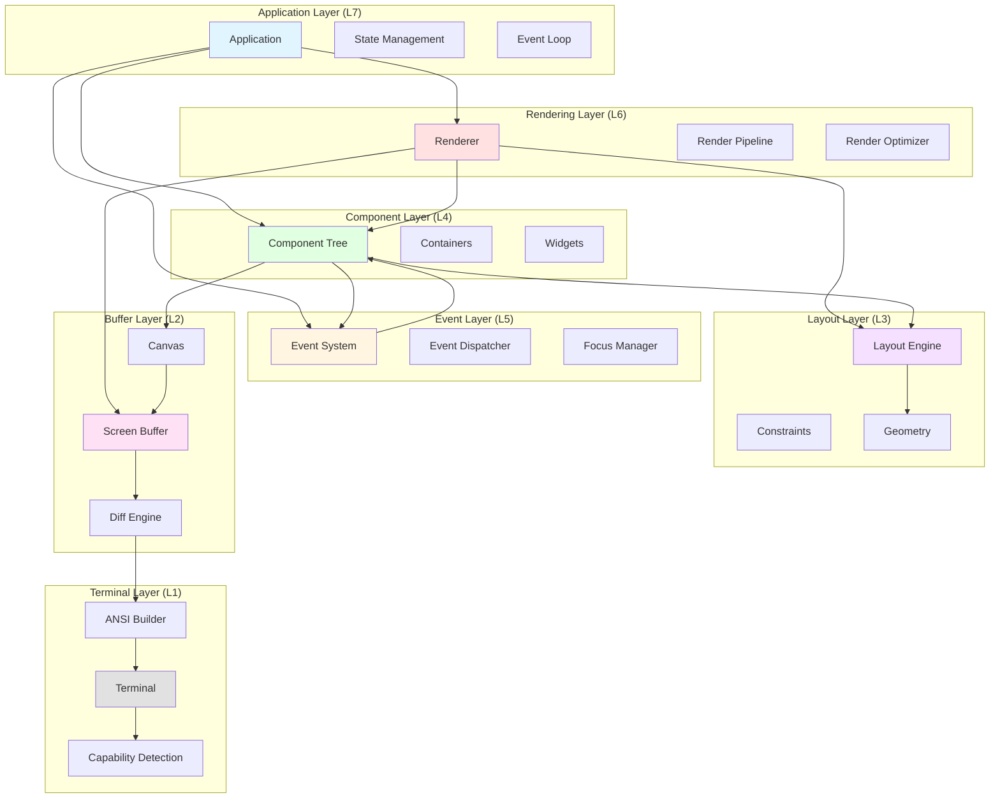
```mermaid
graph TB
    subgraph "Application Layer (L7)"
        App[Application]
        State[State Management]
        Loop[Event Loop]
    end

    subgraph "Rendering Layer (L6)"
        Renderer[Renderer]
        Pipeline[Render Pipeline]
        Optimizer[Render Optimizer]
    end

    subgraph "Component Layer (L4)"
        Component[Component Tree]
        Container[Containers]
        Widget[Widgets]
    end

    subgraph "Event Layer (L5)"
        EventSys[Event System]
        Dispatcher[Event Dispatcher]
        Focus[Focus Manager]
    end

    subgraph "Layout Layer (L3)"
        Layout[Layout Engine]
        Constraints[Constraints]
        Geometry[Geometry]
    end

    subgraph "Buffer Layer (L2)"
        Buffer[Screen Buffer]
        Canvas[Canvas]
        Diff[Diff Engine]
    end

    subgraph "Terminal Layer (L1)"
        Terminal[Terminal]
        Capability[Capability Detection]
        ANSI[ANSI Builder]
    end

    App --> Renderer
    App --> EventSys
    App --> Component
    Renderer --> Component
    Renderer --> Layout
    Renderer --> Buffer
    Component --> Layout
    Component --> Canvas
    Component --> EventSys
    EventSys --> Component
    Layout --> Geometry
    Canvas --> Buffer
    Buffer --> Diff
    Diff --> ANSI
    ANSI --> Terminal
    Terminal --> Capability
    style App fill: #e1f5ff
    style Renderer fill: #ffe1e1
    style Component fill: #e1ffe1
    style EventSys fill: #fff5e1
    style Layout fill: #f5e1ff
    style Buffer fill: #ffe1f5
    style Terminal fill: #e1e1e1
```

### Communication Patterns

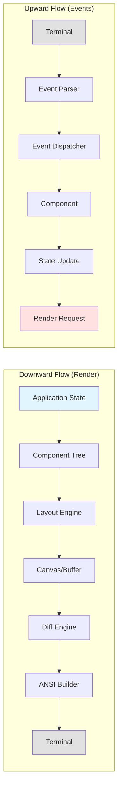
```mermaid
graph LR
    subgraph "Downward Flow (Render)"
        A[Application State] --> B[Component Tree]
        B --> C[Layout Engine]
        C --> D[Canvas/Buffer]
        D --> E[Diff Engine]
        E --> F[ANSI Builder]
        F --> G[Terminal]
    end

    subgraph "Upward Flow (Events)"
        G2[Terminal] --> H[Event Parser]
        H --> I[Event Dispatcher]
        I --> J[Component]
        J --> K[State Update]
        K --> L[Render Request]
    end

    style A fill: #e1f5ff
    style G fill: #e1e1e1
    style G2 fill: #e1e1e1
    style L fill: #ffe1e1
```

---

## Layer 1: Core Terminal Abstraction

**Purpose:** Provide low-level access to terminal capabilities with minimal abstraction over ANSI/VT100 sequences.

### Class Structure

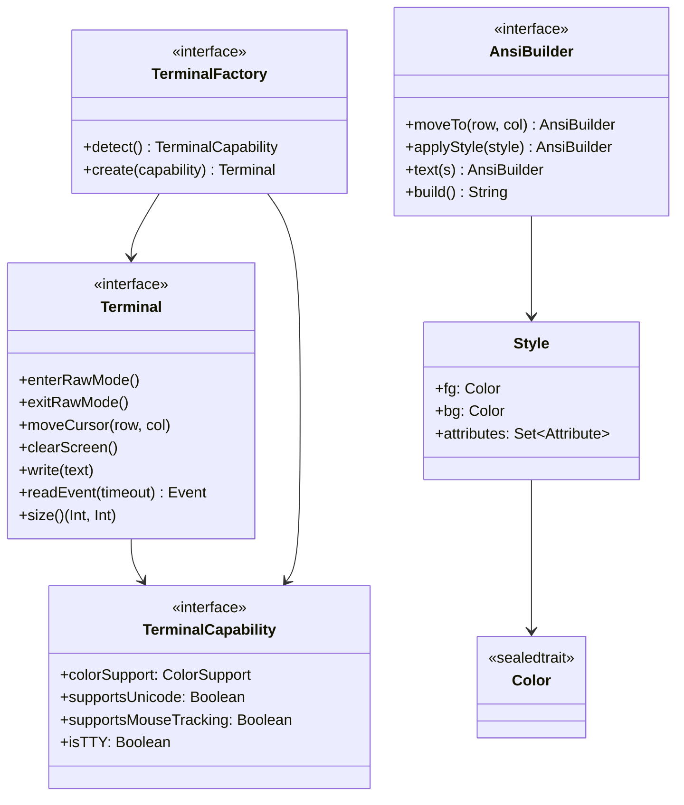
```mermaid
classDiagram
    class Terminal {
        <<interface>>
        +enterRawMode()
        +exitRawMode()
        +moveCursor(row, col)
        +clearScreen()
        +write(text)
        +readEvent(timeout) Event
        +size()(Int, Int)
    }

    class TerminalCapability {
        <<interface>>
        +colorSupport: ColorSupport
        +supportsUnicode: Boolean
        +supportsMouseTracking: Boolean
        +isTTY: Boolean
    }

    class TerminalFactory {
        <<interface>>
        +detect() TerminalCapability
        +create(capability) Terminal
    }

    class AnsiBuilder {
        <<interface>>
        +moveTo(row, col) AnsiBuilder
        +applyStyle(style) AnsiBuilder
        +text(s) AnsiBuilder
        +build() String
    }

    class Color {
<<sealedtrait>>
}

class Style {
+fg: Color
+bg: Color
+attributes: Set~Attribute~
}

Terminal --> TerminalCapability
TerminalFactory --> Terminal
TerminalFactory --> TerminalCapability
AnsiBuilder --> Style
Style --> Color
```

### Responsibilities

- **Terminal**: Execute ANSI escape sequences, manage terminal state
- **TerminalCapability**: Query and report terminal features
- **TerminalFactory**: Select appropriate terminal implementation based on capabilities
- **AnsiBuilder**: Construct ANSI escape sequences efficiently
- **Color/Style**: Represent visual styling with capability awareness

### Key Interfaces

```scala
trait Terminal:
  // Lifecycle
  def enterRawMode(): Unit

  def exitRawMode(): Unit

  def enterAlternateBuffer(): Unit

  def exitAlternateBuffer(): Unit

  // Cursor operations
  def moveCursor(row: Int, col: Int): Unit

  def hideCursor(): Unit

  def showCursor(): Unit

  // Screen manipulation
  def clearScreen(): Unit

  def clearLine(): Unit

  // Scrolling regions
  def setScrollRegion(top: Int, bottom: Int): Unit

  def resetScrollRegion(): Unit

  // I/O
  def write(text: String): Unit

  def flush(): Unit

  def size: (Int, Int)

  def readEvent(timeout: Duration): Option[Event]

trait TerminalCapability:
  def colorSupport: ColorSupport

  def supportsUnicode: Boolean

  def supportsMouseTracking: Boolean

  def supportsAlternateBuffer: Boolean

  def isTTY: Boolean
```

---

## Layer 2: Buffer and Cell Management

**Purpose:** Manage screen state as a grid of cells, enabling efficient differential rendering.

### Class Structure

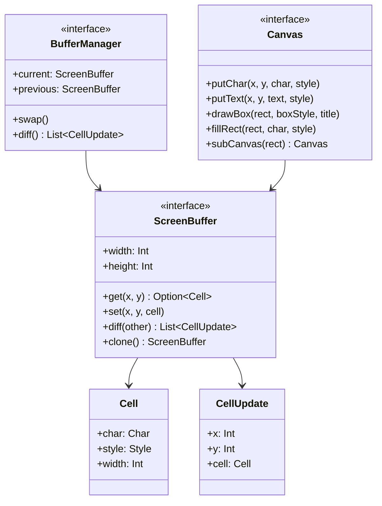
```mermaid
classDiagram
    class Cell {
        +char: Char
        +style: Style
        +width: Int
    }

    class ScreenBuffer {
        <<interface>>
        +width: Int
        +height: Int
        +get(x, y) Option~Cell~
        +set(x, y, cell)
        +diff(other) List~CellUpdate~
        +clone() ScreenBuffer
    }

    class BufferManager {
        <<interface>>
        +current: ScreenBuffer
        +previous: ScreenBuffer
        +swap()
        +diff() List~CellUpdate~
    }

    class Canvas {
        <<interface>>
        +putChar(x, y, char, style)
        +putText(x, y, text, style)
        +drawBox(rect, boxStyle, title)
        +fillRect(rect, char, style)
        +subCanvas(rect) Canvas
    }

    class CellUpdate {
        +x: Int
        +y: Int
        +cell: Cell
    }

    ScreenBuffer --> Cell
    BufferManager --> ScreenBuffer
    Canvas --> ScreenBuffer
    ScreenBuffer --> CellUpdate
```

### Responsibilities

- **Cell**: Represent a single character with styling at a screen position
- **ScreenBuffer**: Store complete screen state as a 2D grid of cells
- **BufferManager**: Coordinate double-buffering for flicker-free rendering
- **Canvas**: Provide high-level drawing primitives
- **CellUpdate**: Describe a minimal change to the screen

### Buffer Double-Buffering Flow

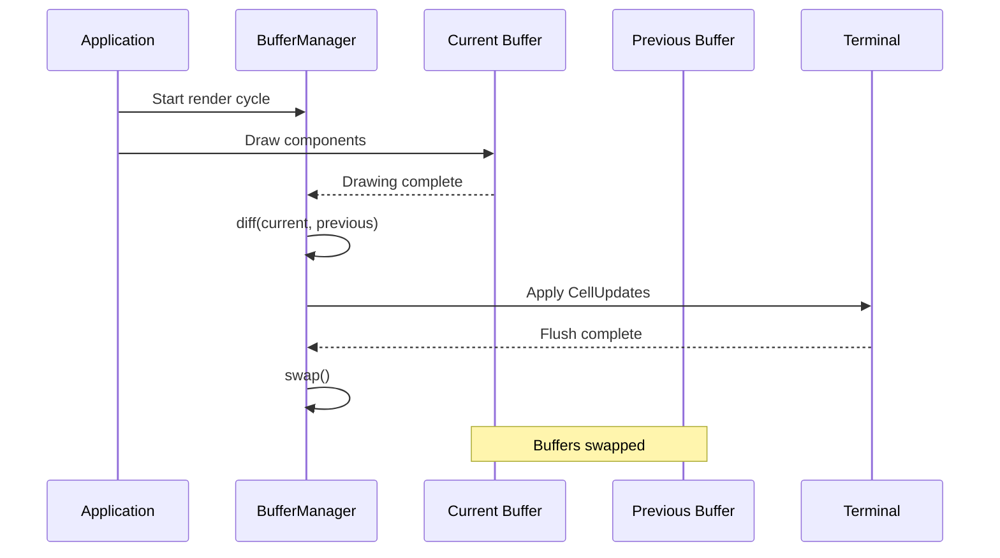
```mermaid
sequenceDiagram
    participant App as Application
    participant Mgr as BufferManager
    participant Cur as Current Buffer
    participant Prev as Previous Buffer
    participant Term as Terminal
    App ->> Mgr: Start render cycle
    App ->> Cur: Draw components
    Cur -->> Mgr: Drawing complete
    Mgr ->> Mgr: diff(current, previous)
    Mgr ->> Term: Apply CellUpdates
    Term -->> Mgr: Flush complete
    Mgr ->> Mgr: swap()
    Note over Cur, Prev: Buffers swapped
```

### Key Interfaces

```scala
case class Cell(
                 char: Char,
                 style: Style,
                 width: Int = 1
               )

trait ScreenBuffer:
  def width: Int

  def height: Int

  def get(x: Int, y: Int): Option[Cell]

  def set(x: Int, y: Int, cell: Cell): Unit

  def fill(rect: Rect, cell: Cell): Unit

  def clear(): Unit

  def diff(other: ScreenBuffer): List[CellUpdate]

trait Canvas:
  def width: Int

  def height: Int

  def putChar(x: Int, y: Int, char: Char, style: Style = Style()): Unit

  def putText(x: Int, y: Int, text: String, style: Style = Style()): Unit

  def drawBox(rect: Rect, boxStyle: BoxStyle, title: Option[String] = None): Unit

  def subCanvas(rect: Rect): Canvas
```

### RenderOp Stream and Scroll Regions

The diff stream's element type is `RenderOp`, a sealed ADT with four variants
that carries everything needed to translate state changes into ANSI:

```scala
enum RenderOp:
  case Cell(x: Int, y: Int, cell: buffer.Cell)
  case SetScrollRegion(region: ScrollRegion)
  case ResetScrollRegion
  case ScrollRegionLine(region: ScrollRegion, line: Line)
```

`Cell` ops are the cell-grid updates that replace the older `CellUpdate`
type. The three region ops manage hardware scroll regions (DECSTBM):

- `SetScrollRegion` / `ResetScrollRegion` are emitted at region boundaries
  when `current.scrollRegion` differs from `previous.scrollRegion`.
- `ScrollRegionLine` is emitted by `BufferManager.diff` when
  `current.pendingScrollLines` is non-empty. The op carries its own
  `ScrollRegion` so `BufferFlusher` can position the cursor and the Renderer
  can mirror `previous` without consulting buffer state.

#### `ScrollableCanvas` — the consumer-facing primitive

`Canvas.scrollRegion(top, bottom)` returns a `ScrollableCanvas`, a leaf-only
handle that exposes `appendLine(line: Line)` and `clear()`. Each `appendLine`
shifts the region's rows up by one in the buffer and enqueues a
`ScrollRegionLine` op. The actual hardware scroll happens at the terminal
when the op is flushed: the `BufferFlusher` emits SU (`ESC[S`, scroll content
up by 1) followed by a cursor move and the line's cells, leaving the new
content at the region's bottom row — matching the buffer's post-`appendLineInRegion`
state exactly.

This primitive serves the four named consumer categories: REPL panes, log
widgets, file content viewers, and build/test output streams.

#### Buffer-coherence across the scroll

After `BufferFlusher` emits a `ScrollRegionLine`, the Renderer mirrors the
post-scroll state onto `previous` via `previous.appendLineInRegion(region, line)`
— the same pure cell-shift used for `current` writes. This keeps `previous`
aligned with what's actually on screen, so subsequent frames' cell-diffs
don't redundantly rewrite scrolled rows. `BufferManager.diff` further skips
region rows during the cell-comparison when pending scroll-line ops exist:
those rows are governed by the `ScrollRegionLine` op, not per-cell repaint.

`BufferManager.swap` propagates the active scroll-region declaration from
the outgoing `current` to the new `current`, so panels declare the region
once at setup and don't re-declare every frame. Crucially, `swap` preserves
the cells *inside* the active region (`clearOutsideRegion` rather than
`clearCells`), so the mirror's accumulated history — what's actually on the
terminal — survives across frames. Without this, the buffer would only ever
hold the most recently-appended line in its region rows; when a panel later
called `scroller.clear()` to tear down, the diff would only see one line of
difference and miss the 17 other lines visible on screen.

#### Column extent and future extension

For this iteration scroll regions are full-width — DECSLRM column margins
are out of scope (poorly supported across modern terminals; software
column-clipping would contradict the "use the terminal's native scroll"
premise). `RenderOp.SetScrollRegion(region: ScrollRegion)` is the canonical
case. If a `Rect`-ergonomic construction shape is later wanted, the natural
extension is a companion `apply(rect: Rect)` overload that desugars to row
bounds — no new ADT variant required, and source-compatible with existing
call sites.

---

## Layer 3: Layout System

**Purpose:** Calculate sub-rectangles within a parent area using constraint-based
algorithms.

**Status (2026-05-09):** Layer 3 ships everything *except* `LayoutManager`,
which depends on the Layer 4 `Component` type. The pure resolver
(`LayoutEngine.resolve` + `LayoutEngine.split`) is complete, along with the
`Constraint` ADT, `Direction` enum, `Layout` value type, and a
`Rect.split(layout)` extension method.

### Class Structure

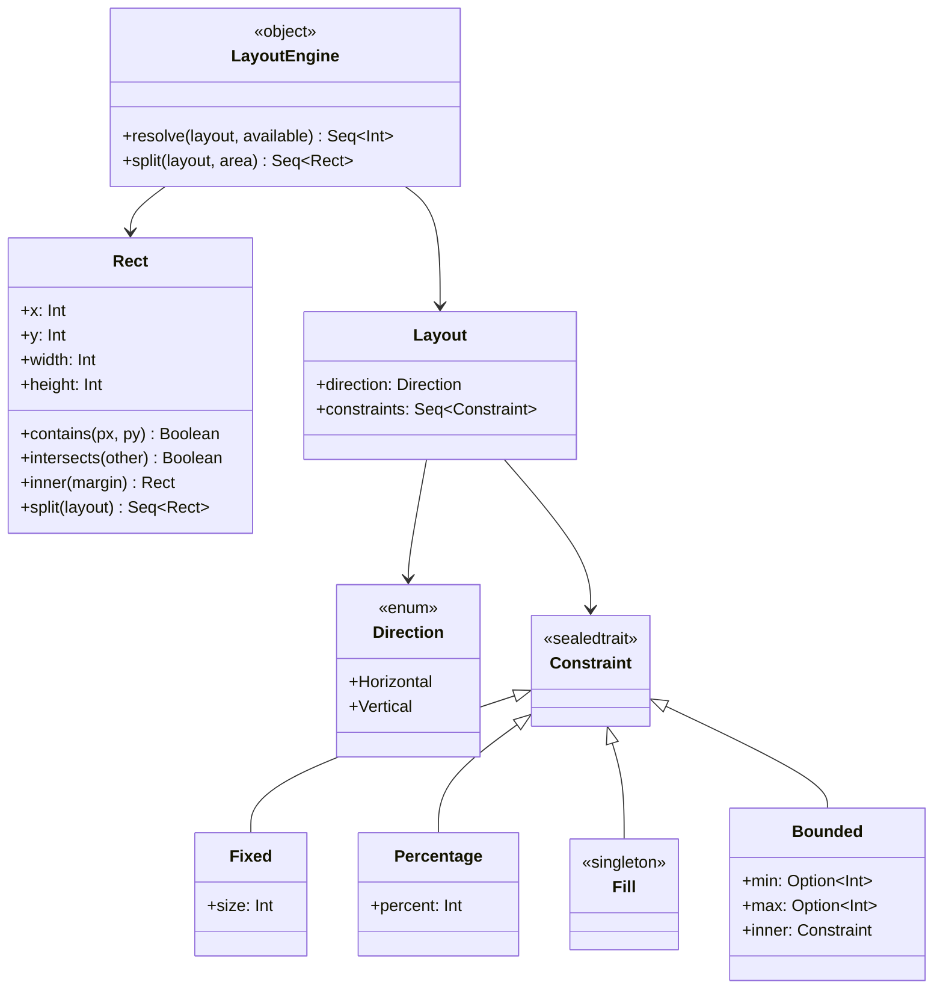
```mermaid
classDiagram
    class Rect {
        +x: Int
        +y: Int
        +width: Int
        +height: Int
        +contains(px, py) Boolean
        +intersects(other) Boolean
        +inner(margin) Rect
        +split(layout) Seq~Rect~
    }

    class Direction {
<<enum>>
+Horizontal
+Vertical
}

class Constraint {
<<sealedtrait>>
}

class Fixed { +size: Int }
class Percentage { +percent: Int }
class Fill { <<singleton>> }
class Bounded {
+min: Option~Int~
+max: Option~Int~
+inner: Constraint
}

class Layout {
+direction: Direction
+constraints: Seq~Constraint~
}

class LayoutEngine {
<<object>>
+resolve(layout, available) Seq~Int~
+split(layout, area) Seq~Rect~
}

Constraint <|-- Fixed
Constraint <|-- Percentage
Constraint <|-- Fill
Constraint <|-- Bounded
Layout --> Direction
Layout --> Constraint
LayoutEngine --> Layout
LayoutEngine --> Rect
```

### Layout Constraint Resolution

`LayoutEngine.resolve` is a pure single-pass algorithm with three sub-passes
followed by a truncation step. No I/O, no ZIO effects.

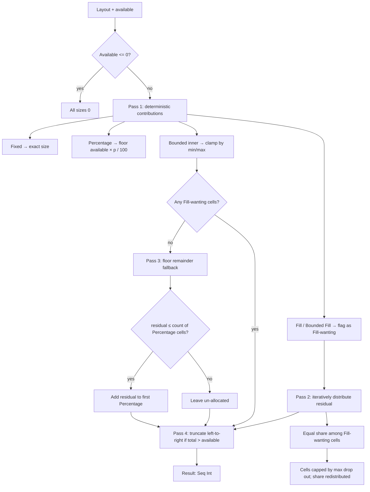
```mermaid
graph TD
    A[Layout + available] --> B{Available <= 0?}
    B -- yes --> Z[All sizes 0]
    B -- no --> C[Pass 1: deterministic contributions]
    C --> D[Fixed → exact size]
    C --> E[Percentage → floor available × p / 100]
    C --> F[Bounded inner → clamp by min/max]
    C --> G[Fill / Bounded Fill → flag as Fill-wanting]
    G --> H[Pass 2: iteratively distribute residual]
    H --> I[Equal share among Fill-wanting cells]
    I --> J[Cells capped by max drop out; share redistributed]
    F --> K{Any Fill-wanting cells?}
    K -- no --> L[Pass 3: floor remainder fallback]
    L --> M{residual ≤ count of Percentage cells?}
    M -- yes --> N[Add residual to first Percentage]
    M -- no --> O[Leave un-allocated]
    H --> P[Pass 4: truncate left-to-right if total > available]
    K -- yes --> P
    O --> P
    N --> P
    P --> Q[Result: Seq Int]
```

**Pass 3 floor-remainder rule.** When no `Fill` cells exist, only the
floor-rounding remainder is distributed — never user under-specification
bleed. Floor loss across N percentage cells is strictly less than N (each
loses <1 cell to flooring), so a residual ≤ N is rounding dust and is
absorbed by the first `Percentage`. A residual greater than N indicates the
user declared less than 100 % coverage (e.g. `Percentage(40)` alone of 100);
the un-allocated space is left alone, total < available is fine.

**`Percentage` rounding.** Always `floor`. Three `Percentage(33)` of 100 →
`[33, 33, 33]` (1 cell unused, percentages declared 99 %, not 100 %). Two
`Percentage(50)` of 99 → `[50, 49]` (residual=1, count=2, 1 ≤ 2, so the
floor remainder distributes).

### Responsibilities

- **Rect**: Geometric rectangle with utility operations (Layer 2)
- **Direction**: Horizontal / Vertical axis enumeration
- **Constraint**: Declarative sizing requirement; ADT with five cases
- **Layout**: Direction + ordered constraints
- **LayoutEngine**: Pure resolver + rectangle splitter
- **LayoutManager** *(deferred to Layer 4)*: bridges resolved layouts to a
  component tree; lands with the component model

### Key Interfaces

```scala
package layout

enum Direction:
  case Horizontal, Vertical

sealed trait Constraint
object Constraint:
  final case class Fixed(size: Int) extends Constraint           // size >= 0
  final case class Percentage(percent: Int) extends Constraint   // percent in [0, 100]
  case object Fill extends Constraint
  final case class Bounded(
    min:   Option[Int],
    max:   Option[Int],
    inner: Constraint
  ) extends Constraint                                            // inner != Bounded

  // Smart constructors for the common Bounded shapes
  def atLeast(min: Int, inner: Constraint): Constraint
  def atMost(max: Int, inner: Constraint): Constraint
  def bounded(min: Int, max: Int, inner: Constraint): Constraint

final case class Layout(direction: Direction, constraints: Seq[Constraint])
object Layout:
  def horizontal(constraints: Constraint*): Layout
  def vertical  (constraints: Constraint*): Layout

object LayoutEngine:
  def resolve(layout: Layout, available: Int): Seq[Int]
  def split  (layout: Layout, area: Rect):     Seq[Rect]

extension (rect: Rect)
  def split(layout: Layout): Seq[Rect]   // delegates to LayoutEngine.split
```

### Example Layout

```scala
import layout.{Constraint, Layout, LayoutEngine, split}

// Three-panel horizontal layout
val outer = Layout.horizontal(
  Constraint.Percentage(30),   // Left sidebar: 30 %
  Constraint.Fill,             // Centre content: remaining
  Constraint.Fixed(20)         // Right palette: 20 cells
)

// Resolve to sizes for an 80-cell width
LayoutEngine.resolve(outer, 80)
// → Seq(24, 36, 20)

// Or split a Rect directly via the extension
val area = geometry.Rect(0, 0, 80, 24)
area.split(outer)
// → Seq(Rect(0, 0, 24, 24), Rect(24, 0, 36, 24), Rect(60, 0, 20, 24))

// Bounded — "30 % but at least 20 cells"
Constraint.atLeast(20, Constraint.Percentage(30))
```

---

## Layer 4: Component Model

**Purpose:** Define the visual contract and a small set of composable
widgets so application code declares UIs as data trees rather than
imperative drawing sequences.

**Status (2026-05-09):** Layer 4 ships the `Component` contract,
layout-bearing containers (`HBox`, `VBox`), the `Panel`/`Text`/`Spacer`
widget set, and a `RawCanvas` escape hatch. Events, focus, and dispatch
are deferred to Layer 5. Component state is a separate concern not
addressed in this layer; the tree is pure data and rendering is a
synchronous fold over that data.

### Design Principle: Pair-Per-Child

The defining decision in this layer: **layout-bearing containers carry
a single list of `(Constraint, Component)` pairs**, not separate lists
of constraints and children. Drift between sizing intent and child
identity is therefore **structurally impossible** — there is no syntax
for an HBox whose constraint count disagrees with its child count.
Adding, removing, or reordering a child is a single edit to a single
list; mismatches cannot be written.

This is a stronger guarantee than `require(constraints.size == children.size)`:
the runtime check would fire on the failing construction and produce a
stack trace pointing into the constructor; the pair-per-child design
makes the failure mode unrepresentable in the source.

### Class Structure

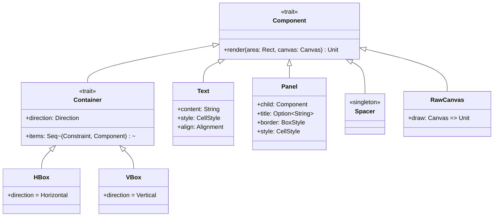
```mermaid
classDiagram
    class Component {
        <<trait>>
        +render(area: Rect, canvas: Canvas) Unit
    }

    class Container {
        <<trait>>
        +items: Seq~(Constraint, Component)~
        +direction: Direction
    }

    class HBox { +direction = Horizontal }
    class VBox { +direction = Vertical   }

    class Text {
        +content: String
        +style: CellStyle
        +align: Alignment
    }

    class Panel {
        +child: Component
        +title: Option~String~
        +border: BoxStyle
        +style: CellStyle
    }

    class Spacer { <<singleton>> }

    class RawCanvas {
        +draw: Canvas =&gt; Unit
    }

    Component <|-- Container
    Component <|-- Text
    Component <|-- Panel
    Component <|-- Spacer
    Component <|-- RawCanvas
    Container <|-- HBox
    Container <|-- VBox
```

### Component Rendering Flow

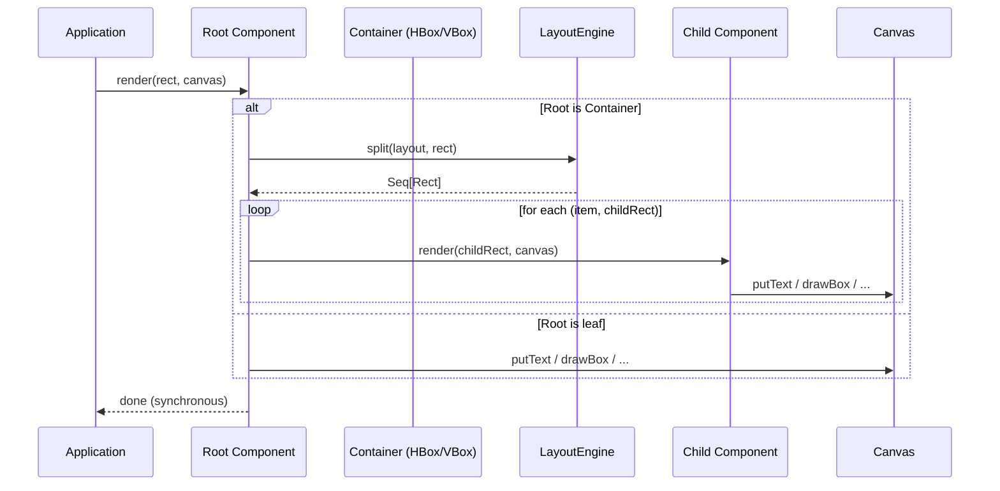
```mermaid
sequenceDiagram
    participant App as Application
    participant Root as Root Component
    participant Container as Container (HBox/VBox)
    participant LE as LayoutEngine
    participant Child as Child Component
    participant Canvas as Canvas
    App ->> Root: render(rect, canvas)
    alt Root is Container
        Root ->> LE: split(layout, rect)
        LE -->> Root: Seq[Rect]
        loop for each (item, childRect)
            Root ->> Child: render(childRect, canvas)
            Child ->> Canvas: putText / drawBox / ...
        end
    else Root is leaf
        Root ->> Canvas: putText / drawBox / ...
    end
    Root -->> App: done (synchronous)
```

### Responsibilities

- **Component**: Base contract — `render(area: Rect, canvas: Canvas): Unit`. Open for extension; library consumers define their own widgets.
- **Container** (`HBox`, `VBox`): Pair-per-child sequence of
  `(Constraint, Component)`. Constructs a Layer 3 `Layout` internally
  and delegates rect-allocation to `LayoutEngine.split`. Two `apply`
  overloads — explicit pairs and bare children (defaulting to `Fill`).
- **Text**: Single-line styled text with `Left`/`Center`/`Right`
  alignment. Truncation at area boundary; word-wrap deferred.
- **Panel**: Bordered container around a single child. Renders the
  border on the outer rect and renders the child into `area.inner(1)`.
- **Spacer**: A no-op renderer used for explicit blank cells
  (separators, padding) inside containers.
- **RawCanvas**: Escape-hatch leaf carrying a `Canvas => Unit` callback.
  Receives a sub-canvas clipped to its area; coordinates are local to
  the area. Used for dense per-cell rendering (colour grids, palettes)
  and Layer-2 demonstrations (positional writes) that gain nothing from
  structural decomposition.

The architecture-doc concept of a separate `LayoutManager` orchestrator
is deliberately absent at this layer: the tree *is* the layout. Each
container's `render` performs the local rect-allocation fold; nothing
above the component tree needs to compute or cache a `LayoutResult`.

### Key Interfaces

```scala
package component

trait Component:
  def render(area: Rect, canvas: Canvas): Unit

trait Container extends Component:
  def items:     Seq[(Constraint, Component)]
  def direction: Direction

final case class HBox(items: Seq[(Constraint, Component)]) extends Container
object HBox:
  val empty: HBox
  def apply(items: (Constraint, Component)*): HBox             // explicit pairs
  def apply(children: Component*)(using DummyImplicit): HBox   // all-Fill default

final case class VBox(items: Seq[(Constraint, Component)]) extends Container
object VBox:
  val empty: VBox
  def apply(items: (Constraint, Component)*): VBox
  def apply(children: Component*)(using DummyImplicit): VBox

final case class Text(content: String, style: CellStyle = ..., align: Alignment = Left) extends Component
final case class Panel(
  child:  Component       = Spacer,
  title:  Option[String]  = None,
  border: BoxStyle        = BoxStyle.Single,
  style:  CellStyle       = CellStyle.Empty
) extends Component
case object Spacer extends Component
final case class RawCanvas(draw: Canvas => Unit) extends Component

enum Alignment:
  case Left, Center, Right
```

### Example Tree

```scala
import component.*
import layout.Constraint

VBox(
  Constraint.Fixed(3) -> Panel(
    border = BoxStyle.Double,
    child  = Text("My App", align = Alignment.Center)
  ),
  Constraint.Fill -> HBox(
    Constraint.Fixed(20) -> Panel(title = Some("Sidebar"), child = Text("...")),
    Constraint.Fill      -> Panel(title = Some("Content"), child = VBox(
      Constraint.Fixed(3) -> Text("Header"),
      Constraint.Fill     -> Text("Body"),
      Constraint.Fixed(3) -> Text("Footer")
    ))
  )
)
```

Adding a sidebar panel is one edit. Reordering is one edit. The
constraint and the component travel as a single value — there is no
"constraint list" to keep in sync with a "children list".

### Deferred to Future Layers

- **Component identity** (`ComponentId`) — needed for event routing; lands with Layer 5
- **`handleEvent`** and event-result types — Layer 5
- **State binding** (props/state, refs, lifecycle) — separate concern;
  the pure-tree shape doesn't preclude future stateful wrappers
- **Wrapped text** (`WrappedText` widget) — depends on Unicode-width-aware
  utilities planned for the text-processing phase
- **List with selection** — depends on focus/event handling
- **`ProgressBar`, `Spinner` as components** — wait for Layer 6 render-loop
  infrastructure; meanwhile their legacy panels coexist
- **Padding type** — `Panel(child = Panel(child = ...))` composes for
  symmetric inset; richer `Padding(top, right, bottom, left)` is a
  follow-up
- **Gaps between layout cells** — naturally added later as a `gap`
  parameter on `HBox`/`VBox` if a real consumer needs it

---

## Layer 5: Event System

**Purpose:** Convert raw terminal input bytes into a stream of typed events that downstream code can consume.

**Shipped surface (this iteration):**
- `Event` ADT in package `event` — `KeyEvent` (with `CharKey` / `SpecialKey` cases), reserved `MouseEvent` sub-trait, reserved `Resize` case
- `EventParser` — pure stateful parser: `(ParserState, Chunk[Byte]) => (ParserState, Chunk[Event])`
- `Terminal.events` — `ZStream[Any, IOException, Event]` driven by `Ref[ParserState]` over `readRaw`, with 50 ms lone-ESC disambiguation
- Demo migration: static panels advance on keypress, animated panels race their animation against the next keypress, `q` and `Ctrl+C` exit cleanly

**Deferred to Layer 6+:**
- `EventDispatcher` — routing events into the component tree
- `FocusManager` — keyboard focus tracking
- `EventResult` ADT — without dispatch + bubbling there's nothing to consume
- `Component.handleEvent` — the visual contract on `Component` stays read-only at Layer 5

The deferral mirrors the discipline applied to Layer 3 (`LayoutManager` removed) and Layer 4 (mutable `addChild` / `removeChild` removed): each of these features lands more coherently alongside Layer 6's render loop, which already needs to know "what's where on screen" to handle resize re-layout. Pulling them forward fragments Layer 5; deferring keeps it shippable and tests-driven by the parser surface alone.

**Deferred follow-ups (not Layer 6's concern either):**
- Mouse event emission (X10/SGR decoding + `Terminal.enableMouseTracking`)
- `Resize` event emission — detection mechanism (poll vs `sun.misc.Signal` / SIGWINCH vs JNA) parked until consumer demand clarifies; the `Resize` case stays reserved in the ADT
- Bracketed paste (`ESC [ 200 ~` ... `ESC [ 201 ~`)
- Terminal focus events (`ESC [ I` / `ESC [ O`)
- Configurable lone-ESC timeout
- SMP codepoints (4-byte UTF-8) — depends on whether `Cell` is widened from `Char` to `String`

### Event Type Hierarchy

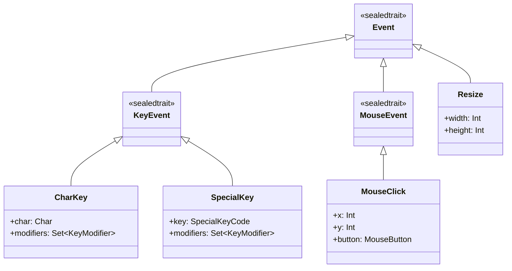
```mermaid
classDiagram
    class Event {
<<sealedtrait>>
}

class KeyEvent {
<<sealedtrait>>
}

class MouseEvent {
<<sealedtrait>>
}

class CharKey {
+char: Char
+modifiers: Set~KeyModifier~
}

class SpecialKey {
+key: SpecialKeyCode
+modifiers: Set~KeyModifier~
}

class MouseClick {
+x: Int
+y: Int
+button: MouseButton
}

class Resize {
+width: Int
+height: Int
 }

Event <|-- KeyEvent
Event <|-- MouseEvent
Event <|-- Resize
KeyEvent <|-- CharKey
KeyEvent <|-- SpecialKey
MouseEvent <|-- MouseClick
```

### Parser Pipeline (shipped)

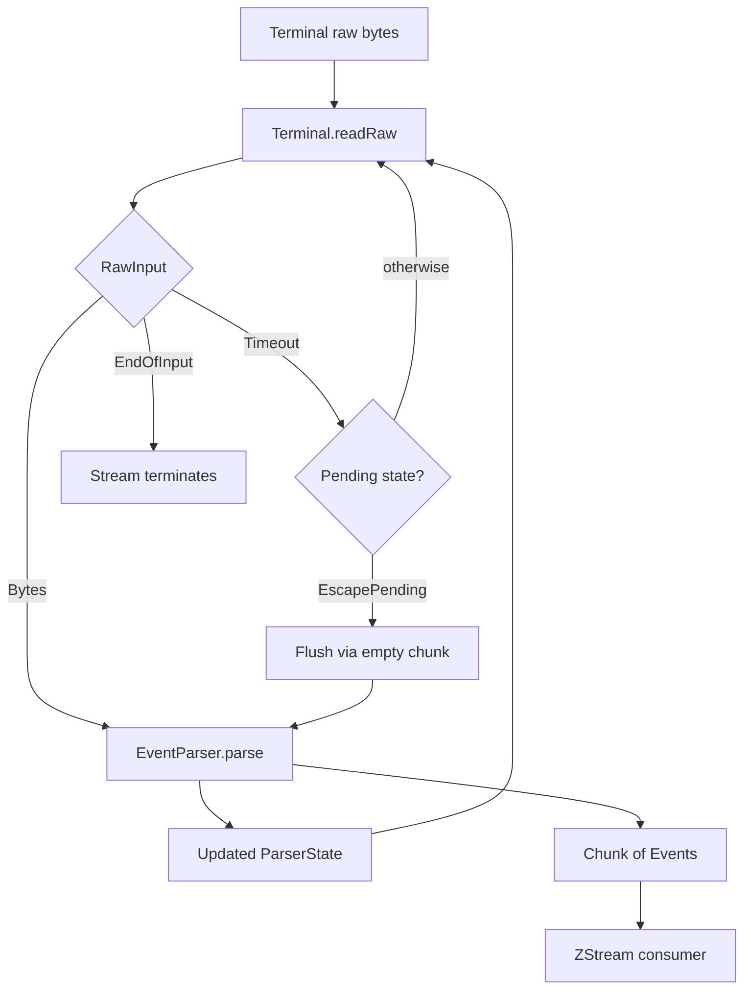
```mermaid
graph TD
    A[Terminal raw bytes] --> B[Terminal.readRaw]
    B --> C{RawInput}
    C -->|Bytes| D[EventParser.parse]
    C -->|Timeout| E{Pending state?}
    C -->|EndOfInput| F[Stream terminates]
    E -->|EscapePending| G[Flush via empty chunk]
    E -->|otherwise| B
    G --> D
    D --> H[Updated ParserState]
    D --> I[Chunk of Events]
    H --> B
    I --> J[ZStream consumer]
```

### Tab/Enter/Backspace Encoding (Q1/Q2 ratified 2026-05-10)

The parser surfaces every byte-level distinction the terminal exposes; collapse only happens when the byte stream forces it. Symmetrical and principled.

| Byte   | Event                              | Notes                                                      |
|--------|------------------------------------|------------------------------------------------------------|
| `0x09` | `SpecialKey(Tab)`                  | Tab and `Ctrl+I` share this byte — collapse forced         |
| `0x0D` | `SpecialKey(Enter)`                | Modern terminals send `0x0D` for the Enter key in raw mode |
| `0x0A` | `CharKey('j', Set(Ctrl))`          | `Ctrl+J`; preserved as a distinct hotkey                   |
| `0x7F` | `SpecialKey(Backspace)`            | Modern terminals send `0x7F` for the Backspace key         |
| `0x08` | `CharKey('h', Set(Ctrl))`          | `Ctrl+H`; preserved as a distinct hotkey                   |
| `0x1B` | `SpecialKey(Escape)` (after 50 ms) | Lone ESC; alt-prefix sequences resolved within the window  |

The library principle: surface every byte-level distinction the terminal makes available, so consumers retain the freedom to bind `Ctrl+J` and `Ctrl+H` as distinct hotkeys. Applications that prefer the simpler "Enter is Enter" framing use the `SimpleKey` extractor described below — a per-match-site choice, not a global mode.

### Future: Event Dispatch (deferred to Layer 6)

The architecture below describes the *target* shape of event dispatch. None of `EventDispatcher`, `FocusManager`, `EventFilter`, `EventListener`, or `EventResult` ship in Layer 5. They are recorded here so the design space stays known when Layer 6's render-loop work begins.

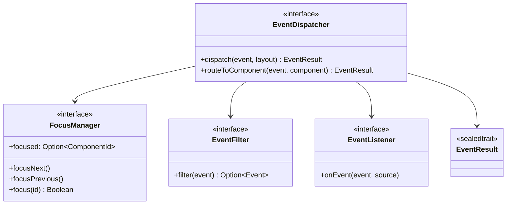
```mermaid
classDiagram
    class EventDispatcher {
        <<interface>>
        +dispatch(event, layout) EventResult
        +routeToComponent(event, component) EventResult
    }

    class FocusManager {
        <<interface>>
        +focused: Option~ComponentId~
        +focusNext()
        +focusPrevious()
        +focus(id) Boolean
    }

    class EventFilter {
        <<interface>>
        +filter(event) Option~Event~
    }

    class EventListener {
        <<interface>>
        +onEvent(event, source)
    }

    class EventResult {
<<sealedtrait>>
}

EventDispatcher --> FocusManager
EventDispatcher --> EventFilter
EventDispatcher --> EventListener
EventDispatcher --> EventResult
```

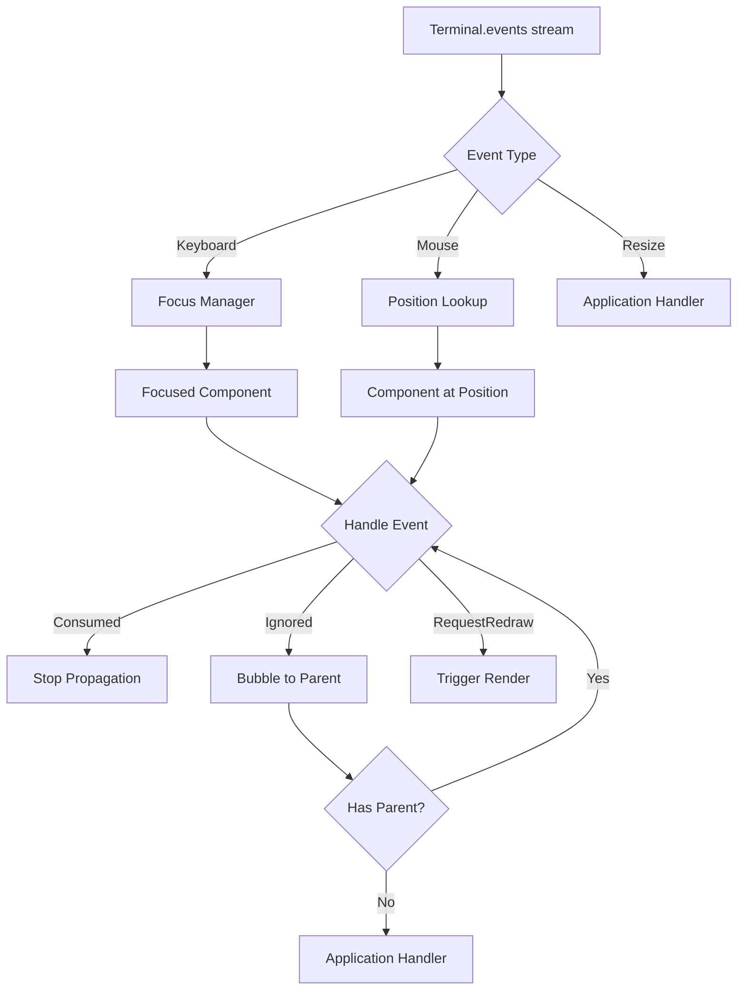
```mermaid
graph TD
    A[Terminal.events stream] --> B{Event Type}
    B -->|Keyboard| C[Focus Manager]
    B -->|Mouse| D[Position Lookup]
    B -->|Resize| E[Application Handler]
    C --> F[Focused Component]
    D --> G[Component at Position]
    F --> H{Handle Event}
    G --> H
    H -->|Consumed| I[Stop Propagation]
    H -->|Ignored| J[Bubble to Parent]
    H -->|RequestRedraw| K[Trigger Render]
    J --> L{Has Parent?}
    L -->|Yes| H
    L -->|No| M[Application Handler]
```

### Responsibilities (shipped)

- **`Event`**: Typed representation of terminal input
- **`EventParser`**: Pure stateful translator from byte chunks to event chunks
- **`ParserState`**: Threaded state for partial sequences (CSI mid-buffer, lone-ESC pending, UTF-8 mid-decode)
- **`TerminalEvents`**: Drives `EventParser` over `Terminal.readRaw`, with lone-ESC timeout flushing
- **`Terminal.events`**: `ZStream` accessor — both as a default trait method and a service-style companion accessor

### Responsibilities (deferred to Layer 6)

- **`EventDispatcher`**: Route events to appropriate components
- **`FocusManager`**: Track and manage keyboard focus
- **`EventFilter`**: Intercept and transform events globally
- **`EventListener`**: React to events for side effects
- **`EventResult`**: Component's response to event handling

### Key Interfaces (shipped)

```scala
// package event

sealed trait Event

object Event:
  /** Reserved: emission deferred until detection mechanism is ratified. */
  final case class Resize(width: Int, height: Int) extends Event

sealed trait KeyEvent extends Event

object KeyEvent:
  final case class CharKey(char: Char, modifiers: Set[KeyModifier]) extends KeyEvent
  final case class SpecialKey(key: SpecialKeyCode, modifiers: Set[KeyModifier]) extends KeyEvent

/** Reserved sub-trait for future MouseClick/MouseDrag/MouseScroll cases. */
sealed trait MouseEvent extends Event

enum KeyModifier:
  case Ctrl, Alt, Shift

enum SpecialKeyCode:
  case Up, Down, Left, Right
  case Home, End, PgUp, PgDn
  case Enter, Escape, Tab, Backspace, Insert, Delete
  case F1, F2, F3, F4, F5, F6, F7, F8, F9, F10, F11, F12

sealed trait ParserState

object ParserState:
  case object Idle extends ParserState
  case object EscapePending extends ParserState
  final case class Csi(buf: Vector[Byte]) extends ParserState
  case object Ss3 extends ParserState
  final case class Utf8(buf: Vector[Byte], expectedLen: Int) extends ParserState

object EventParser:
  def parse(state: ParserState, bytes: Chunk[Byte]): (ParserState, Chunk[Event])

object TerminalEvents:
  val LoneEscTimeout: Duration = Duration.fromMillis(50)
  def events(terminal: Terminal): ZStream[Any, IOException, Event]

trait Terminal:
  def events: ZStream[Any, IOException, Event] = TerminalEvents.events(this)

object Terminal:
  def events: ZStream[Terminal, IOException, Event] =
    ZStream.serviceWithStream[Terminal](_.events)
```

### Key Interfaces (deferred to Layer 6)

```scala
sealed trait EventResult

object EventResult:
  case object Consumed extends EventResult
  case object Ignored extends EventResult
  case object RequestRedraw extends EventResult

trait EventDispatcher:
  def dispatch(event: Event, layout: LayoutResult): EventResult

trait FocusManager:
  def focused: Option[ComponentId]
  def focusNext(): Unit
  def focus(id: ComponentId): Boolean
```

### CTRL+C in Raw Mode

The most user-visible side-effect of Layer 5: **`Ctrl+C` is a parsed event, not a SIGINT**. In raw mode the OS does not generate SIGINT for `0x03` — the byte is delivered to the application like any other. This is the correct behaviour for an interactive TUI library (matching `vim`, `htop`, `less`, `top`) and gives applications a chance to confirm-before-quit, save-on-exit, etc.

The demo's `DemoApp` recognises `CharKey('c', Set(Ctrl))` as an exit trigger via `DemoUtils.isExitKey`. The `ZIO.acquireRelease` blocks still fire on every exit path — alt buffer, hidden cursor, raw mode all restore even if the user short-circuits the panel sequence or an unexpected error fires.

### Future Enhancement: Simple vs Raw Key Matcher Helpers

> Not part of Layer 5 or Layer 6 — captured here so the design space is recorded. Lands when at least one consumer category has driven the need.

The Layer 5 parser preserves every byte-level distinction the terminal
exposes (so `0x0D` → `SpecialKey(Enter)` but `0x0A` → `CharKey('j', Set(Ctrl))`,
and `0x7F` → `SpecialKey(Backspace)` but `0x08` → `CharKey('h', Set(Ctrl))`).
This is the correct contract for a *library*: consumers retain the
freedom to bind every hotkey the terminal makes distinguishable, and the
library cannot pre-collapse `Ctrl+J` or `Ctrl+H` without holding back a
hotkey from downstream applications.

Most applications, however, want the simpler "Enter is Enter" framing
and treat a stream of `Ctrl+J` events from a Unix-line-ending paste as a
bug, not a feature. A small helper layer can offer both views without
forcing either:

```scala
package event

object KeyMatcher:
  /** Collapses the ambiguous ctrl-letter pairs into their named-key equivalents. */
  def simple(event: KeyEvent): KeyEvent = event match
    case CharKey('j', m) if m == Set(KeyModifier.Ctrl) =>
      SpecialKey(SpecialKeyCode.Enter, Set.empty)
    case CharKey('h', m) if m == Set(KeyModifier.Ctrl) =>
      SpecialKey(SpecialKeyCode.Backspace, Set.empty)
    case other => other

  /** Pass-through; preserves byte-level fidelity. */
  def raw(event: KeyEvent): KeyEvent = event

/** Pattern-match ergonomics: `case SimpleKey(SpecialKey(Enter, _)) => ...` */
object SimpleKey:
  def unapply(event: KeyEvent): Option[KeyEvent] =
    Some(KeyMatcher.simple(event))
```

Consumers that don't care write `case SimpleKey(SpecialKey(Enter, _))`
and `Ctrl+J` folds in automatically. Applications that bind `Ctrl+J` or
`Ctrl+H` as distinct hotkeys match on the raw event directly. The
canonical event stream — what the parser emits, what dispatch routes —
stays byte-faithful; the helper sits at the application's match-arm
boundary, not inside dispatch.

The collapse table is fixed by the byte-level distinctions the parser
already exposes:

| Distinguishable pair                | Simple-mode collapse    |
|-------------------------------------|-------------------------|
| `0x0D` Enter / `0x0A` Ctrl+J        | `Ctrl+J` → `Enter`      |
| `0x7F` Backspace / `0x08` Ctrl+H    | `Ctrl+H` → `Backspace`  |

Tab and `Ctrl+I` need no helper — both bytes are `0x09` and are
collapsed at parse time by the byte stream itself.

**Scope guard.** This helper is bounded by the table above. It is *not*
the start of a general "friendly events" framework — paste detection,
key-chord debouncing, multi-tap, etc. are unrelated concerns and should
not accrete here. If a future need crosses the table's bound, that
feature designs its own surface.

**Layer 6 interaction.** When `Component.handleEvent` lands, dispatch
operates on the raw event. The application owns the simple-vs-raw
choice per match site — `case SimpleKey(...)` or `case raw event` is a
local decision, not a system-wide mode toggle.

No `Terminal` contract change required. Lands as `event.KeyMatcher` and
`event.SimpleKey`, behind any future PR that proves the consumer demand.

---

## Layer 6: Rendering Pipeline

**Purpose:** Coordinate the rendering process from component tree to terminal output.

### Rendering Pipeline Stages

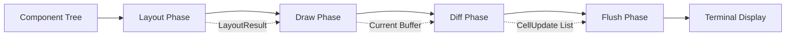
```mermaid
graph LR
    A[Component Tree] --> B[Layout Phase]
    B --> C[Draw Phase]
    C --> D[Diff Phase]
    D --> E[Flush Phase]
    E --> F[Terminal Display]
    B -.->|LayoutResult| C
    C -.->|Current Buffer| D
    D -.->|CellUpdate List| E
```

### Detailed Pipeline Flow

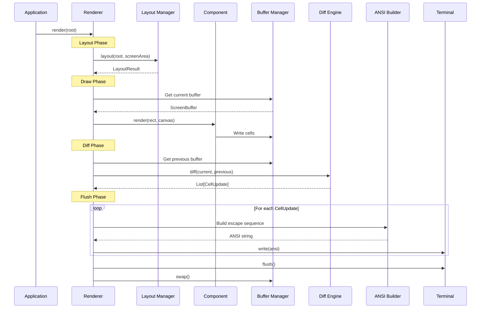
```mermaid
sequenceDiagram
    participant App as Application
    participant Render as Renderer
    participant Layout as Layout Manager
    participant Comp as Component
    participant Buf as Buffer Manager
    participant Diff as Diff Engine
    participant ANSI as ANSI Builder
    participant Term as Terminal
    App ->> Render: render(root)
    Note over Render: Layout Phase
    Render ->> Layout: layout(root, screenArea)
    Layout -->> Render: LayoutResult
    Note over Render: Draw Phase
    Render ->> Buf: Get current buffer
    Buf -->> Render: ScreenBuffer
    Render ->> Comp: render(rect, canvas)
    Comp ->> Buf: Write cells
    Note over Render: Diff Phase
    Render ->> Buf: Get previous buffer
    Render ->> Diff: diff(current, previous)
    Diff -->> Render: List[CellUpdate]
    Note over Render: Flush Phase
    loop For each CellUpdate
        Render ->> ANSI: Build escape sequence
        ANSI -->> Render: ANSI string
        Render ->> Term: write(ansi)
    end

    Render ->> Term: flush()
    Render ->> Buf: swap()
```

### Class Structure

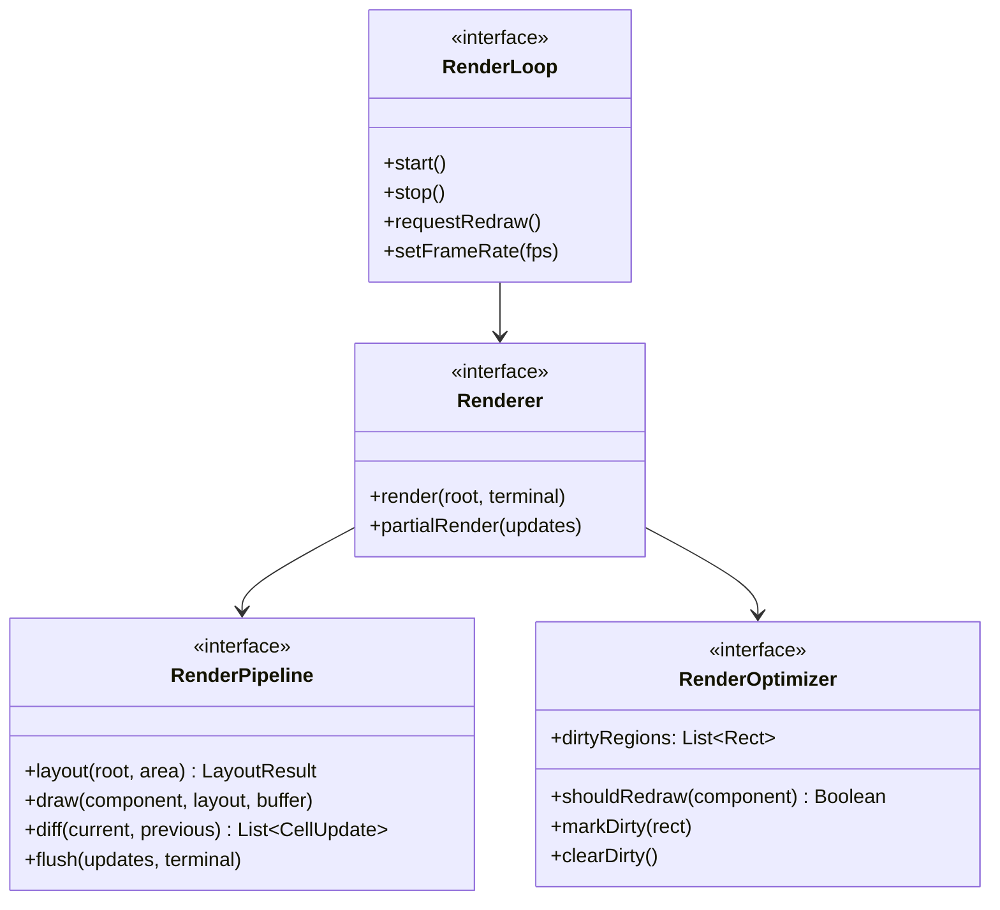
```mermaid
classDiagram
    class Renderer {
        <<interface>>
        +render(root, terminal)
        +partialRender(updates)
    }

    class RenderPipeline {
        <<interface>>
        +layout(root, area) LayoutResult
        +draw(component, layout, buffer)
        +diff(current, previous) List~CellUpdate~
        +flush(updates, terminal)
    }

    class RenderOptimizer {
        <<interface>>
        +shouldRedraw(component) Boolean
        +dirtyRegions: List~Rect~
        +markDirty(rect)
        +clearDirty()
    }

    class RenderLoop {
        <<interface>>
        +start()
        +stop()
        +requestRedraw()
        +setFrameRate(fps)
    }

    Renderer --> RenderPipeline
    Renderer --> RenderOptimizer
    RenderLoop --> Renderer
```

### Responsibilities

- **Renderer**: Orchestrate the complete rendering process
- **RenderPipeline**: Execute the four rendering phases
- **RenderOptimizer**: Track dirty regions to minimize work
- **RenderLoop**: Manage render timing and frame rate

### Rendering Modes

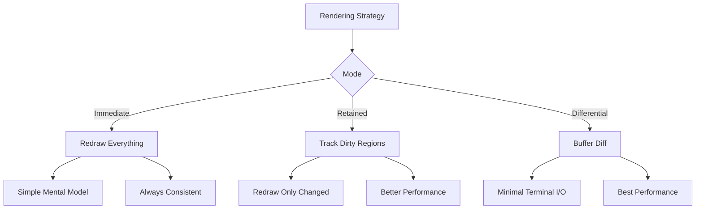
```mermaid
graph TD
    A[Rendering Strategy] --> B{Mode}
    B -->|Immediate| C[Redraw Everything]
    C --> D[Simple Mental Model]
    C --> E[Always Consistent]
    B -->|Retained| F[Track Dirty Regions]
    F --> G[Redraw Only Changed]
    F --> H[Better Performance]
    B -->|Differential| I[Buffer Diff]
    I --> J[Minimal Terminal I/O]
    I --> K[Best Performance]
```

### Key Interfaces

```scala
trait Renderer:
  def render(root: Component, terminal: Terminal): Unit

trait RenderPipeline:
  def layout(root: Component, area: Rect): LayoutResult

  def draw(component: Component, layout: LayoutResult, buffer: ScreenBuffer): Unit

  def diff(current: ScreenBuffer, previous: ScreenBuffer): List[CellUpdate]

  def flush(updates: List[CellUpdate], terminal: Terminal): Unit

trait RenderLoop:
  def start(): Unit

  def stop(): Unit

  def requestRedraw(): Unit

  def setFrameRate(fps: Int): Unit
```

---

## Layer 7: Application Framework

**Purpose:** Provide the main application lifecycle and state management.

### Application Architecture

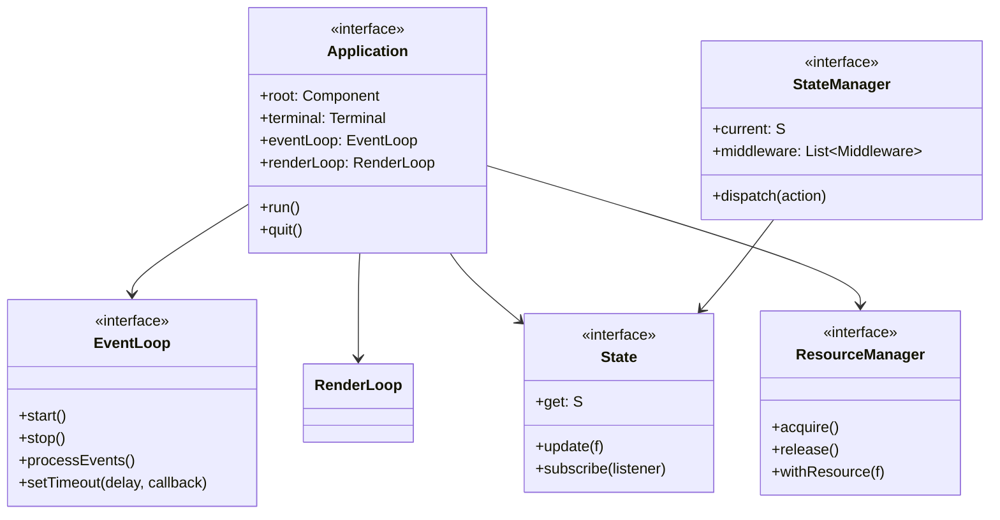
```mermaid
classDiagram
    class Application {
        <<interface>>
        +root: Component
        +terminal: Terminal
        +eventLoop: EventLoop
        +renderLoop: RenderLoop
        +run()
        +quit()
    }

    class EventLoop {
        <<interface>>
        +start()
        +stop()
        +processEvents()
        +setTimeout(delay, callback)
    }

    class State {
        <<interface>>
        +get: S
        +update(f)
        +subscribe(listener)
    }

    class StateManager {
        <<interface>>
        +current: S
        +dispatch(action)
        +middleware: List~Middleware~
    }

    class ResourceManager {
        <<interface>>
        +acquire()
        +release()
        +withResource(f)
    }

    Application --> EventLoop
    Application --> RenderLoop
    Application --> State
    Application --> ResourceManager
    StateManager --> State
```

### Application Lifecycle

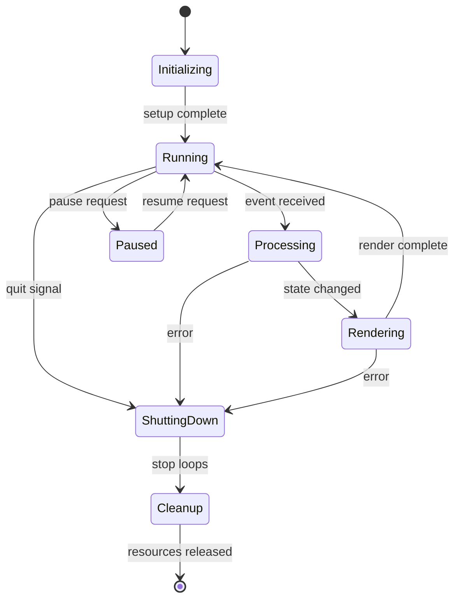
```mermaid
stateDiagram-v2
    [*] --> Initializing
    Initializing --> Running: setup complete
    Running --> Processing: event received
    Processing --> Rendering: state changed
    Rendering --> Running: render complete
    Running --> Paused: pause request
    Paused --> Running: resume request
    Running --> ShuttingDown: quit signal
    Processing --> ShuttingDown: error
    Rendering --> ShuttingDown: error
    ShuttingDown --> Cleanup: stop loops
    Cleanup --> [*]: resources released
```

### Main Application Loop

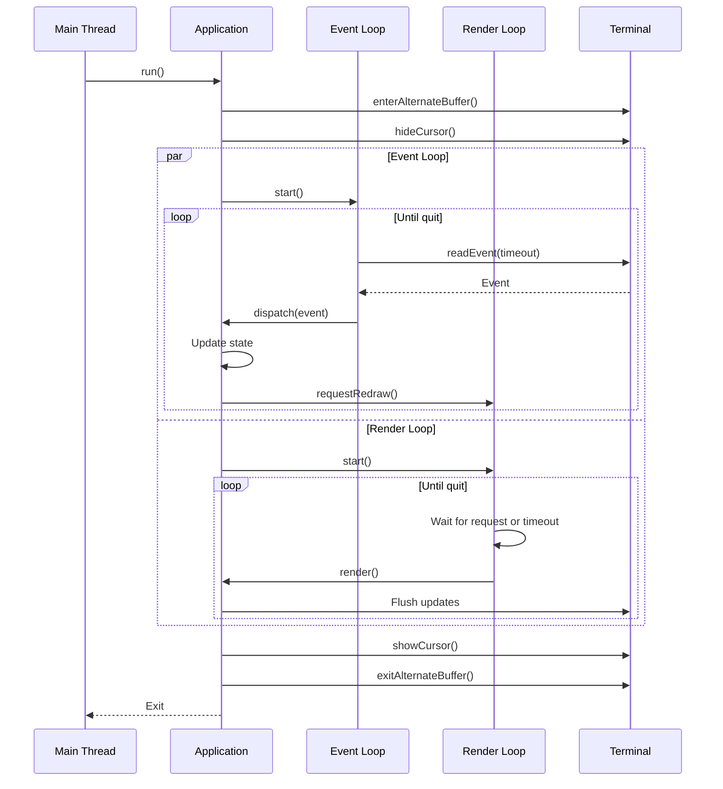
```mermaid
sequenceDiagram
    participant Main as Main Thread
    participant App as Application
    participant ELoop as Event Loop
    participant RLoop as Render Loop
    participant Term as Terminal
    Main ->> App: run()
    App ->> Term: enterAlternateBuffer()
    App ->> Term: hideCursor()

    par Event Loop
        App ->> ELoop: start()
        loop Until quit
            ELoop ->> Term: readEvent(timeout)
            Term -->> ELoop: Event
            ELoop ->> App: dispatch(event)
            App ->> App: Update state
            App ->> RLoop: requestRedraw()
        end
    and Render Loop
        App ->> RLoop: start()
        loop Until quit
            RLoop ->> RLoop: Wait for request or timeout
            RLoop ->> App: render()
            App ->> Term: Flush updates
        end
    end

    App ->> Term: showCursor()
    App ->> Term: exitAlternateBuffer()
    App -->> Main: Exit
```

### Responsibilities

- **Application**: Main entry point, lifecycle coordinator
- **EventLoop**: Process terminal input continuously
- **RenderLoop**: Manage rendering timing and frame rate
- **State**: Application state container with reactivity
- **StateManager**: Coordinate state updates and side effects
- **ResourceManager**: Ensure proper cleanup of terminal state

### Key Interfaces

```scala
trait Application:
  def root: Component

  def terminal: Terminal

  def eventLoop: EventLoop

  def renderLoop: RenderLoop

  def run(): Unit

  def quit(): Unit

trait EventLoop:
  def start(): Unit

  def stop(): Unit

  def processEvents(): Unit

trait State[S]:
  def get: S

  def update(f: S => S): Unit

  def subscribe(listener: S => Unit): Unit
```

---

## Communication Flows

### Downward Flow: Rendering

The rendering flow moves data from application state to screen pixels:

```mermaid
flowchart TD
    A[Application State Changed] --> B[Render Request]
    B --> C[Layout Manager]
    C --> D{For Each Component}
    D --> E[Calculate Constraints]
    E --> F[Compute Rectangle]
    F --> G[Store in LayoutResult]
    G --> H[Component.render]
    H --> I[Canvas Operations]
    I --> J[Write to Buffer]
    J --> K[All Components Done?]
    K -->|No| D
    K -->|Yes| L[Diff Engine]
    L --> M[Compare Buffers]
    M --> N[Generate CellUpdates]
    N --> O[ANSI Builder]
    O --> P[Build Escape Sequences]
    P --> Q[Terminal.write]
    Q --> R[Terminal.flush]
    R --> S[Screen Updated]
```

### Upward Flow: Event Handling

Events travel from terminal input to application state:

```mermaid
flowchart TD
    A[Terminal Input] --> B[Terminal.readEvent]
    B --> C[Parse into Event Object]
    C --> D{Event Type?}
    D -->|Keyboard| E[Focus Manager]
    E --> F[Get Focused Component]
    D -->|Mouse| G[Layout Lookup]
    G --> H[Find Component at Position]
    D -->|Resize| I[Application Handler]
    F --> J[Component.handleEvent]
    H --> J
    J --> K{EventResult?}
    K -->|Consumed| L[Stop Propagation]
    K -->|Ignored| M{Has Parent?}
    K -->|RequestRedraw| N[Render Loop]
    M -->|Yes| O[Parent.handleEvent]
    M -->|No| P[Application Handler]
    O --> K
    L --> Q[Event Processing Complete]
    P --> Q
    N --> R[Mark Dirty]
    R --> S[Schedule Render]
    S --> Q
```

### Bi-Directional: Component ↔ Layout

Components and the layout manager communicate bidirectionally:

```mermaid
sequenceDiagram
    participant LM as Layout Manager
    participant Cont as Container
    participant Child as Child Component
    Note over LM, Child: Layout Negotiation
    LM ->> Cont: Get your constraints
    Cont -->> LM: My strategy + children
    LM ->> Child: What are your constraints?
    Child -->> LM: ComponentConstraints
    Note over LM: Calculate layout
    LM ->> Cont: Here's your rect
    Cont -->> LM: Acknowledged
    LM ->> Child: Here's your rect
    Child -->> LM: Acknowledged
    Note over LM, Child: Rendering Phase
    Cont ->> Child: Render in this rect
    Child ->> Child: Draw content
    Child -->> Cont: Done
```

### Component Isolation

Components cannot directly communicate—they use events and state:

```mermaid
graph TD
    A[Component A] -.->|Cannot directly access| B[Component B]
    A -->|Fire Event| C[Event System]
    C -->|Route to| B
    A -->|Update| D[Shared State]
    D -->|Subscribe| B
    style A fill: #e1f5ff
    style B fill: #e1ffe1
    style C fill: #fff5e1
    style D fill: #ffe1e1
```

---

## Design Principles

### 1. Layered Architecture with Clear Boundaries

Each layer has a single responsibility and communicates only with adjacent layers:

- **Terminal Layer**: ANSI operations, no business logic
- **Buffer Layer**: Screen state, no rendering decisions
- **Canvas Layer**: Drawing primitives, no layout knowledge
- **Layout Layer**: Positioning math, no rendering details
- **Component Layer**: UI logic, delegates to lower layers
- **Rendering Layer**: Orchestration, no component logic
- **Application Layer**: Lifecycle, no rendering details

**Benefit**: Changes in one layer don't cascade through the system.

### 2. Immediate Mode Rendering

Components don't store rendered state—they redraw on every frame:

```scala
// Component doesn't track what was drawn
def render(area: Rect, canvas: Canvas): Unit = {
  // Always draw from scratch
  canvas.putText(0, 0, currentText, currentStyle)
  canvas.drawBox(area, boxStyle, title)
}
```

**Advantages**:

- Simple mental model
- No state synchronization bugs
- Easy animations

**Optimization**: Buffer diffing ensures only changed cells hit the terminal.

### 3. Constraint-Based Layouts

Express intent, not pixels:

```scala
// Declarative sizing
Flex(Horizontal, List(
  Constraint.Percentage(30), // Sidebar scales
  Constraint.Fill, // Content takes rest
  Constraint.Fixed(20) // Tool panel fixed
))
```

**Benefit**: Layouts adapt to terminal size automatically.

### 4. Modern Terminals Only - Fail Fast

The library validates terminal capabilities at startup and fails immediately if requirements are not met:

```mermaid
graph TD
    A[Startup] --> B{Check Capabilities}
    B -->|TTY + Colors + Unicode| C[Proceed]
    B -->|Missing Requirements| D[Fail with Clear Error]
    C --> E[Full Feature Set]
    D --> F[List Missing Requirements]
    F --> G[Suggest Supported Terminals]
```

**Requirements (all must be met)**:

- Interactive TTY (not pipe, not redirected)
- 256+ color support
- Unicode support (UTF-8 locale)
- Modern terminal emulator

**No fallback paths.** If requirements are not met, the library fails with a clear error message listing what's missing
and which terminals are supported.

### 5. Component Isolation

Components can only:

- Draw within their allocated `Rect`
- Access a `Canvas` clipped to their boundaries
- Communicate via events and shared state

They cannot:

- Draw outside their rect
- Directly access sibling components
- Modify terminal state directly

**Benefit**: Components are testable in isolation.

### 6. Event Bubbling with Consumption

Events propagate through the component tree:

```
1. Target component (e.g., focused button)
   ↓ if Ignored
2. Parent container
   ↓ if Ignored
3. Root component
   ↓ if Ignored
4. Application handlers
```

`EventResult.Consumed` stops propagation.

**Benefit**: Natural event handling hierarchy, like DOM events.

### 7. Double Buffering for Efficiency

Always maintain two buffers:

```mermaid
graph LR
    A[Current Buffer] -->|Draw| B[Components Write Here]
    C[Previous Buffer] -->|Compare| D[Diff Engine]
    B -->|After Render| E[Swap]
    E -->|Current becomes Previous| A
```

**Benefit**: Only changed cells are written to terminal.

### 8. Resource Safety

Terminal state must be restored on all exits:

```scala
def withResource[A](f: => A): A = {
  try {
    terminal.enterAlternateBuffer()
    terminal.hideCursor()
    f
  } finally {
    terminal.showCursor()
    terminal.exitAlternateBuffer()
  }
}
```

**Benefit**: Terminal is never left in a broken state.

---

## Implementation Considerations

### Performance Targets

Based on the research document:

- **Text wrapping**: <500ms for 10KB documents
- **Pattern recognition**: <100ms per 1KB
- **Capability detection**: <200ms
- **Frame rate**: 30-60 FPS for interactive UIs
- **Event latency**: <16ms (60 FPS target)

### Memory Management

- **Cell size**: ~32 bytes (char + style + metadata)
- **Full screen buffer**: 80×24 = 1,920 cells ≈ 60KB
- **Double buffering**: 2× = 120KB
- Keep previous states for diffing
- Clear buffers after swap to reclaim memory

### Threading Model

Recommended architecture:

```mermaid
graph TD
    A[Main Thread] --> B[Event Loop Thread]
    A --> C[Render Loop Thread]
    B -->|Events| D[Thread-Safe Queue]
    D --> A
    C -->|Render Requests| E[Thread-Safe Flag]
    A -->|State Changes| E
```

**Key Points**:

- Event loop on dedicated thread (blocking reads)
- Render loop on dedicated thread (timed frames)
- Main thread processes events and updates state
- Thread-safe communication via queues/flags

### Error Handling Strategy

Use typed errors for different failure modes:

```scala
sealed trait TerminalError

case class IOError(cause: IOException) extends TerminalError

case class CapabilityError(missing: String) extends TerminalError

case class LayoutError(message: String) extends TerminalError
```

Always restore terminal state:

```scala
try {
  runApplication()
} catch {
  case e: Exception =>
    // Ensure cleanup
    terminal.showCursor()
    terminal.exitAlternateBuffer()
    throw e
}
```

### Testing Strategy

**Unit Tests**:

- Individual layer components in isolation
- Mock dependencies (e.g., mock Terminal for testing Buffer)

**Integration Tests**:

- Full rendering pipeline with mock terminal
- Event routing through component tree
- Layout calculation correctness

**Property-Based Tests**:

- Layout constraints always sum to available space
- Buffer diff is minimal (no redundant updates)
- Event routing reaches correct components

**Supported Terminal Tests**:

- macOS: Terminal.app, iTerm2
- Linux: GNOME Terminal, Konsole, Alacritty, Kitty
- Windows: Windows Terminal only
- SSH sessions with modern terminal clients

**Note:** Legacy terminals (cmd.exe, dumb terminals, Linux console) are not tested as they are out of scope.

### ZIO Integration

This architecture maps naturally to ZIO:

```scala
// Layer 1: Terminal as ZIO service
trait Terminal:
  def write(text: String): Task[Unit]

  def readEvent(timeout: Duration): Task[Option[Event]]

  def size: UIO[(Int, Int)]

// Resource management
val terminalLayer: ZLayer[Any, IOException, Terminal] =
  ZLayer.scoped {
    ZIO.acquireRelease(
      acquire = Terminal.initialize
    )(
      release = terminal => terminal.cleanup
    )
  }

// Application
def runApp: ZIO[Terminal & EventLoop & RenderLoop, IOException, Unit] =
  for {
    _ <- ZIO.serviceWithZIO[Terminal](_.enterAlternateBuffer())
    _ <- ZIO.serviceWithZIO[EventLoop](_.start())
    _ <- ZIO.serviceWithZIO[RenderLoop](_.start())
    result <- applicationLogic
  } yield result
```

**Benefits**:

- Automatic resource cleanup
- Composable effects
- Type-safe dependency injection
- Built-in error handling

---

## Conclusion

This architecture provides a complete foundation for terminal manipulation with:

✅ **7 distinct layers** with clear responsibilities
✅ **Bi-directional communication** (render down, events up)
✅ **Component isolation** for testability
✅ **Efficient rendering** via double-buffering and diffing
✅ **Flexible layouts** using constraint-based system
✅ **Modern terminals only** - no legacy fallback complexity
✅ **Event-driven interaction** with focus management
✅ **Resource safety** with proper cleanup

The system is designed to be:

- **Modular**: Each layer can be developed and tested independently
- **Extensible**: New components and layout strategies are easy to add
- **Efficient**: Differential rendering minimizes terminal I/O
- **Simple**: No fallback paths means less code and fewer bugs
- **Type-safe**: Strong typing catches errors at compile time

**Scope Reminder:** This architecture targets modern interactive terminals only. Legacy terminals (cmd.exe, dumb
terminals) and non-interactive environments (CI/CD, pipes) are explicitly not supported.

Next steps:

1. Begin with Layer 1 (Terminal abstraction)
2. Implement Layer 2 (Buffer management)
3. Build upward through the layers
4. Implement concrete components for common use cases
5. Create comprehensive test suite
6. Optimize based on performance profiling

---

**Document Version:** 1.0
**Last Updated:** 2025-10-27
