# Terminal Manipulation Architecture

**Document Type:** Architecture Specification
**Date:** 2025-10-27
**Purpose:** Define the structure for a feature-complete terminal manipulation library
**Status:** Design Phase

---

## Table of Contents

1. [Executive Summary](#executive-summary)
2. [Architecture Overview](#architecture-overview)
3. [Layer 1: Core Terminal Abstraction](#layer-1-core-terminal-abstraction)
4. [Layer 2: Buffer and Cell Management](#layer-2-buffer-and-cell-management)
5. [Layer 3: Layout System](#layer-3-layout-system)
6. [Layer 4: Component Model](#layer-4-component-model)
7. [Layer 5: Event System](#layer-5-event-system)
8. [Layer 6: Rendering Pipeline](#layer-6-rendering-pipeline)
9. [Layer 7: Application Framework](#layer-7-application-framework)
10. [Communication Flows](#communication-flows)
11. [Design Principles](#design-principles)
12. [Implementation Considerations](#implementation-considerations)

---

## Executive Summary

This architecture defines a layered system for terminal manipulation that provides:

- **Complete terminal control** through ANSI/VT100 escape sequences
- **Bi-directional communication** between components and terminal
- **Modern terminals only** - no fallback paths for legacy environments
- **Efficient rendering** through double-buffering and differential updates
- **Flexible layouts** using constraint-based positioning
- **Event-driven interaction** with keyboard and mouse support

The system is organized into 7 distinct layers, each with clear responsibilities and minimal coupling to adjacent
layers.

> **Scope:** This architecture targets modern interactive terminals only (macOS Terminal, iTerm2, Windows Terminal,
> GNOME Terminal, etc.). Legacy terminals, non-interactive environments, and dumb terminals are explicitly **not supported
**.

---

## Architecture Overview

### Layer Structure

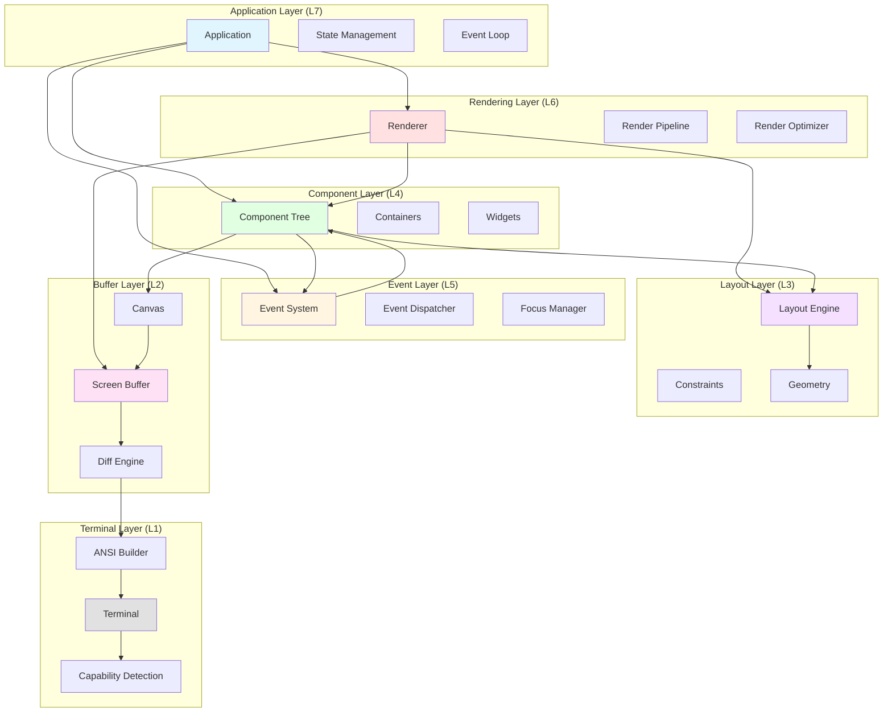
```mermaid
graph TB
    subgraph "Application Layer (L7)"
        App[Application]
        State[State Management]
        Loop[Event Loop]
    end

    subgraph "Rendering Layer (L6)"
        Renderer[Renderer]
        Pipeline[Render Pipeline]
        Optimizer[Render Optimizer]
    end

    subgraph "Component Layer (L4)"
        Component[Component Tree]
        Container[Containers]
        Widget[Widgets]
    end

    subgraph "Event Layer (L5)"
        EventSys[Event System]
        Dispatcher[Event Dispatcher]
        Focus[Focus Manager]
    end

    subgraph "Layout Layer (L3)"
        Layout[Layout Engine]
        Constraints[Constraints]
        Geometry[Geometry]
    end

    subgraph "Buffer Layer (L2)"
        Buffer[Screen Buffer]
        Canvas[Canvas]
        Diff[Diff Engine]
    end

    subgraph "Terminal Layer (L1)"
        Terminal[Terminal]
        Capability[Capability Detection]
        ANSI[ANSI Builder]
    end

    App --> Renderer
    App --> EventSys
    App --> Component
    Renderer --> Component
    Renderer --> Layout
    Renderer --> Buffer
    Component --> Layout
    Component --> Canvas
    Component --> EventSys
    EventSys --> Component
    Layout --> Geometry
    Canvas --> Buffer
    Buffer --> Diff
    Diff --> ANSI
    ANSI --> Terminal
    Terminal --> Capability
    style App fill: #e1f5ff
    style Renderer fill: #ffe1e1
    style Component fill: #e1ffe1
    style EventSys fill: #fff5e1
    style Layout fill: #f5e1ff
    style Buffer fill: #ffe1f5
    style Terminal fill: #e1e1e1
```

### Communication Patterns

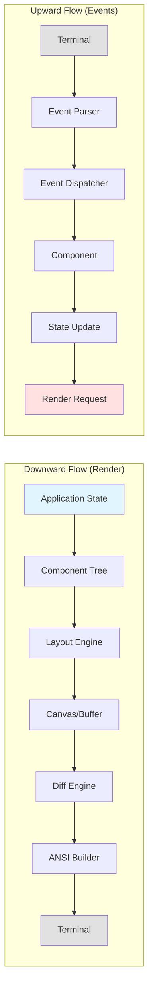
```mermaid
graph LR
    subgraph "Downward Flow (Render)"
        A[Application State] --> B[Component Tree]
        B --> C[Layout Engine]
        C --> D[Canvas/Buffer]
        D --> E[Diff Engine]
        E --> F[ANSI Builder]
        F --> G[Terminal]
    end

    subgraph "Upward Flow (Events)"
        G2[Terminal] --> H[Event Parser]
        H --> I[Event Dispatcher]
        I --> J[Component]
        J --> K[State Update]
        K --> L[Render Request]
    end

    style A fill: #e1f5ff
    style G fill: #e1e1e1
    style G2 fill: #e1e1e1
    style L fill: #ffe1e1
```

---

## Layer 1: Core Terminal Abstraction

**Purpose:** Provide low-level access to terminal capabilities with minimal abstraction over ANSI/VT100 sequences.

### Class Structure

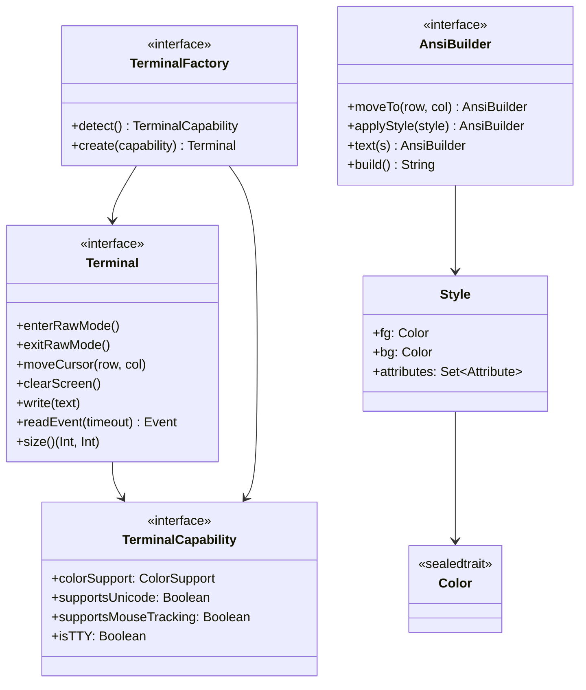
```mermaid
classDiagram
    class Terminal {
        <<interface>>
        +enterRawMode()
        +exitRawMode()
        +moveCursor(row, col)
        +clearScreen()
        +write(text)
        +readEvent(timeout) Event
        +size()(Int, Int)
    }

    class TerminalCapability {
        <<interface>>
        +colorSupport: ColorSupport
        +supportsUnicode: Boolean
        +supportsMouseTracking: Boolean
        +isTTY: Boolean
    }

    class TerminalFactory {
        <<interface>>
        +detect() TerminalCapability
        +create(capability) Terminal
    }

    class AnsiBuilder {
        <<interface>>
        +moveTo(row, col) AnsiBuilder
        +applyStyle(style) AnsiBuilder
        +text(s) AnsiBuilder
        +build() String
    }

    class Color {
<<sealedtrait>>
}

class Style {
+fg: Color
+bg: Color
+attributes: Set~Attribute~
}

Terminal --> TerminalCapability
TerminalFactory --> Terminal
TerminalFactory --> TerminalCapability
AnsiBuilder --> Style
Style --> Color
```

### Responsibilities

- **Terminal**: Execute ANSI escape sequences, manage terminal state
- **TerminalCapability**: Query and report terminal features
- **TerminalFactory**: Select appropriate terminal implementation based on capabilities
- **AnsiBuilder**: Construct ANSI escape sequences efficiently
- **Color/Style**: Represent visual styling with capability awareness

### Key Interfaces

```scala
trait Terminal:
  // Lifecycle
  def enterRawMode(): Unit

  def exitRawMode(): Unit

  def enterAlternateBuffer(): Unit

  def exitAlternateBuffer(): Unit

  // Cursor operations
  def moveCursor(row: Int, col: Int): Unit

  def hideCursor(): Unit

  def showCursor(): Unit

  // Screen manipulation
  def clearScreen(): Unit

  def clearLine(): Unit

  // Scrolling regions
  def setScrollRegion(top: Int, bottom: Int): Unit

  def resetScrollRegion(): Unit

  // I/O
  def write(text: String): Unit

  def flush(): Unit

  def size: (Int, Int)

  def readEvent(timeout: Duration): Option[Event]

trait TerminalCapability:
  def colorSupport: ColorSupport

  def supportsUnicode: Boolean

  def supportsMouseTracking: Boolean

  def supportsAlternateBuffer: Boolean

  def isTTY: Boolean
```

---

## Layer 2: Buffer and Cell Management

**Purpose:** Manage screen state as a grid of cells, enabling efficient differential rendering.

### Class Structure

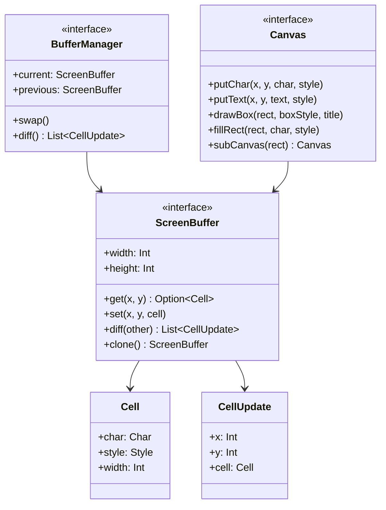
```mermaid
classDiagram
    class Cell {
        +char: Char
        +style: Style
        +width: Int
    }

    class ScreenBuffer {
        <<interface>>
        +width: Int
        +height: Int
        +get(x, y) Option~Cell~
        +set(x, y, cell)
        +diff(other) List~CellUpdate~
        +clone() ScreenBuffer
    }

    class BufferManager {
        <<interface>>
        +current: ScreenBuffer
        +previous: ScreenBuffer
        +swap()
        +diff() List~CellUpdate~
    }

    class Canvas {
        <<interface>>
        +putChar(x, y, char, style)
        +putText(x, y, text, style)
        +drawBox(rect, boxStyle, title)
        +fillRect(rect, char, style)
        +subCanvas(rect) Canvas
    }

    class CellUpdate {
        +x: Int
        +y: Int
        +cell: Cell
    }

    ScreenBuffer --> Cell
    BufferManager --> ScreenBuffer
    Canvas --> ScreenBuffer
    ScreenBuffer --> CellUpdate
```

### Responsibilities

- **Cell**: Represent a single character with styling at a screen position
- **ScreenBuffer**: Store complete screen state as a 2D grid of cells
- **BufferManager**: Coordinate double-buffering for flicker-free rendering
- **Canvas**: Provide high-level drawing primitives
- **CellUpdate**: Describe a minimal change to the screen

### Buffer Double-Buffering Flow

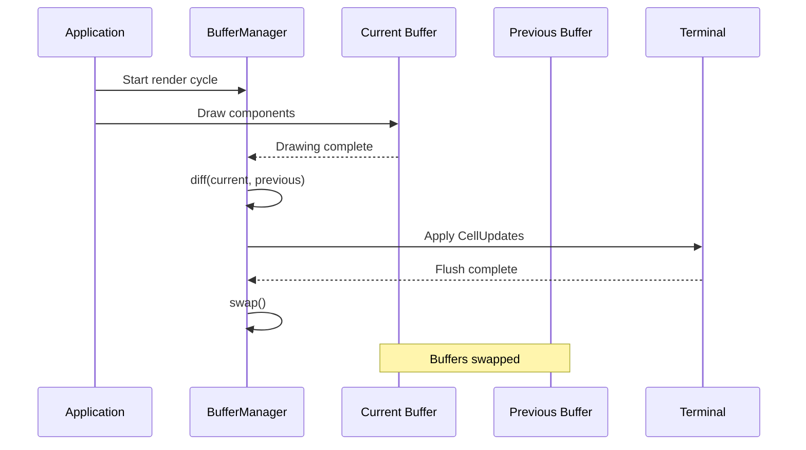
```mermaid
sequenceDiagram
    participant App as Application
    participant Mgr as BufferManager
    participant Cur as Current Buffer
    participant Prev as Previous Buffer
    participant Term as Terminal
    App ->> Mgr: Start render cycle
    App ->> Cur: Draw components
    Cur -->> Mgr: Drawing complete
    Mgr ->> Mgr: diff(current, previous)
    Mgr ->> Term: Apply CellUpdates
    Term -->> Mgr: Flush complete
    Mgr ->> Mgr: swap()
    Note over Cur, Prev: Buffers swapped
```

### Key Interfaces

```scala
case class Cell(
                 char: Char,
                 style: Style,
                 width: Int = 1
               )

trait ScreenBuffer:
  def width: Int

  def height: Int

  def get(x: Int, y: Int): Option[Cell]

  def set(x: Int, y: Int, cell: Cell): Unit

  def fill(rect: Rect, cell: Cell): Unit

  def clear(): Unit

  def diff(other: ScreenBuffer): List[CellUpdate]

trait Canvas:
  def width: Int

  def height: Int

  def putChar(x: Int, y: Int, char: Char, style: Style = Style()): Unit

  def putText(x: Int, y: Int, text: String, style: Style = Style()): Unit

  def drawBox(rect: Rect, boxStyle: BoxStyle, title: Option[String] = None): Unit

  def subCanvas(rect: Rect): Canvas
```

---

## Layer 3: Layout System

**Purpose:** Calculate component positions and sizes using constraint-based algorithms.

### Class Structure

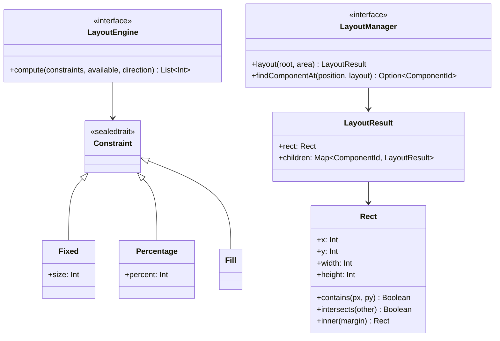
```mermaid
classDiagram
    class Rect {
        +x: Int
        +y: Int
        +width: Int
        +height: Int
        +contains(px, py) Boolean
        +intersects(other) Boolean
        +inner(margin) Rect
    }

    class Constraint {
<<sealedtrait>>
}

class Fixed {
+size: Int
}

class Percentage {
+percent: Int
}

class Fill { 
 }

class LayoutEngine {
<<interface>>
+compute(constraints, available, direction) List~Int~
}

class LayoutManager {
<<interface>>
+layout(root, area) LayoutResult
+findComponentAt(position, layout) Option~ComponentId~
}

class LayoutResult {
+rect: Rect
+children: Map~ComponentId, LayoutResult~
}

Constraint <|-- Fixed
Constraint <|-- Percentage
Constraint <|-- Fill
LayoutEngine --> Constraint
LayoutManager --> LayoutResult
LayoutResult --> Rect
```

### Layout Constraint Resolution

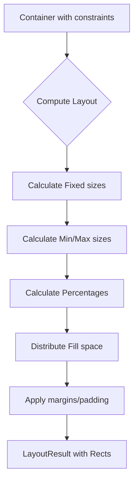
```mermaid
graph TD
    A[Container with constraints] --> B{Compute Layout}
    B --> C[Calculate Fixed sizes]
    C --> D[Calculate Min/Max sizes]
    D --> E[Calculate Percentages]
    E --> F[Distribute Fill space]
    F --> G[Apply margins/padding]
    G --> H[LayoutResult with Rects]
```

### Responsibilities

- **Rect**: Geometric rectangle with utility operations
- **Constraint**: Declarative sizing requirements (Fixed, Percentage, Fill, etc.)
- **LayoutEngine**: Algorithm for computing sizes from constraints
- **LayoutManager**: Coordinate layout calculation for entire component tree
- **LayoutResult**: Store computed positions for all components

### Key Interfaces

```scala
case class Rect(x: Int, y: Int, width: Int, height: Int)

sealed trait Constraint

object Constraint:
  case class Fixed(size: Int) extends Constraint

  case class Min(size: Int) extends Constraint

  case class Max(size: Int) extends Constraint

  case class Percentage(percent: Int) extends Constraint

  case class Fill extends Constraint

trait LayoutEngine:
  def compute(
               constraints: List[Constraint],
               available: Int,
               direction: Direction
             ): List[Int]

trait LayoutManager:
  def layout(root: Component, area: Rect): LayoutResult
```

### Example Layout

```scala
// Three-panel layout
Flex(Horizontal, List(
  Constraint.Percentage(30), // Left sidebar: 30%
  Constraint.Fill, // Center content: remaining
  Constraint.Fixed(20) // Right sidebar: 20 chars
))

// Result for 100 char width:
// Left:   30 chars (30%)
// Center: 50 chars (Fill)
// Right:  20 chars (Fixed)
```

---

## Layer 4: Component Model

**Purpose:** Define the component hierarchy and rendering contract.

### Class Structure

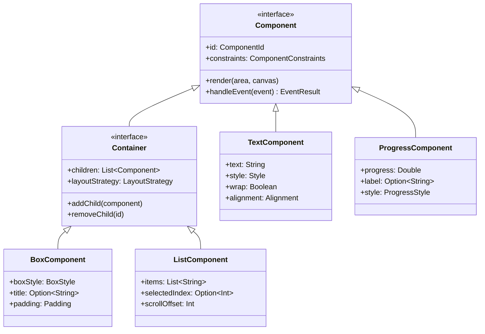
```mermaid
classDiagram
    class Component {
        <<interface>>
        +id: ComponentId
        +render(area, canvas)
        +handleEvent(event) EventResult
        +constraints: ComponentConstraints
    }

    class Container {
        <<interface>>
        +children: List~Component~
        +addChild(component)
        +removeChild(id)
        +layoutStrategy: LayoutStrategy
    }

    class TextComponent {
        +text: String
        +style: Style
        +wrap: Boolean
        +alignment: Alignment
    }

    class ProgressComponent {
        +progress: Double
        +label: Option~String~
        +style: ProgressStyle
    }

    class BoxComponent {
        +boxStyle: BoxStyle
        +title: Option~String~
        +padding: Padding
    }

    class ListComponent {
        +items: List~String~
        +selectedIndex: Option~Int~
        +scrollOffset: Int
    }

    Component <|-- Container
    Component <|-- TextComponent
    Component <|-- ProgressComponent
    Container <|-- BoxComponent
    Container <|-- ListComponent
```

### Component Rendering Flow

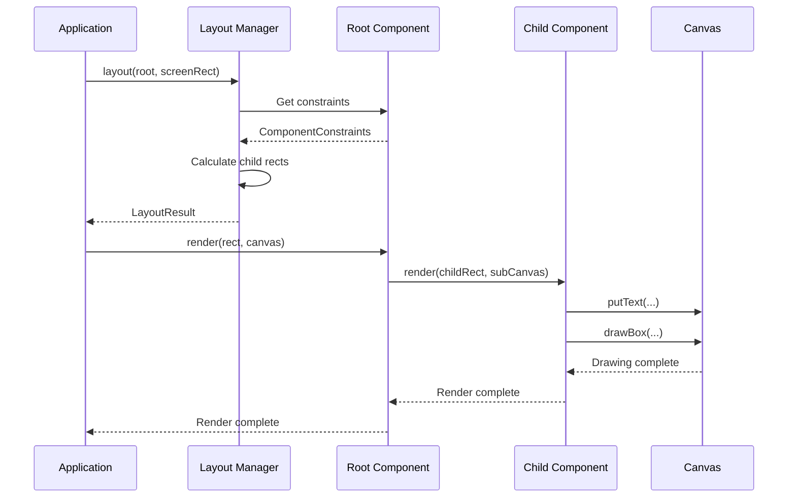
```mermaid
sequenceDiagram
    participant App as Application
    participant Layout as Layout Manager
    participant Root as Root Component
    participant Child as Child Component
    participant Canvas as Canvas
    App ->> Layout: layout(root, screenRect)
    Layout ->> Root: Get constraints
    Root -->> Layout: ComponentConstraints
    Layout ->> Layout: Calculate child rects
    Layout -->> App: LayoutResult
    App ->> Root: render(rect, canvas)
    Root ->> Child: render(childRect, subCanvas)
    Child ->> Canvas: putText(...)
    Child ->> Canvas: drawBox(...)
    Canvas -->> Child: Drawing complete
    Child -->> Root: Render complete
    Root -->> App: Render complete
```

### Responsibilities

- **Component**: Base contract for all UI elements
- **Container**: Component that manages child components
- **TextComponent**: Display text with styling and wrapping
- **ProgressComponent**: Show progress indicators (bars, spinners)
- **BoxComponent**: Container with borders
- **ListComponent**: Scrollable list with selection

### Key Interfaces

```scala
trait Component:
  def id: ComponentId

  def render(area: Rect, canvas: Canvas): Unit

  def handleEvent(event: Event): EventResult

  def constraints: ComponentConstraints

trait Container extends Component:
  def children: List[Component]

  def addChild(component: Component): Unit

  def removeChild(id: ComponentId): Unit

  def layoutStrategy: LayoutStrategy

case class ComponentConstraints(
                                 minWidth: Option[Int] = None,
                                 minHeight: Option[Int] = None,
                                 maxWidth: Option[Int] = None,
                                 maxHeight: Option[Int] = None
                               )
```

---

## Layer 5: Event System

**Purpose:** Handle input events from terminal and route them to appropriate components.

### Event Type Hierarchy

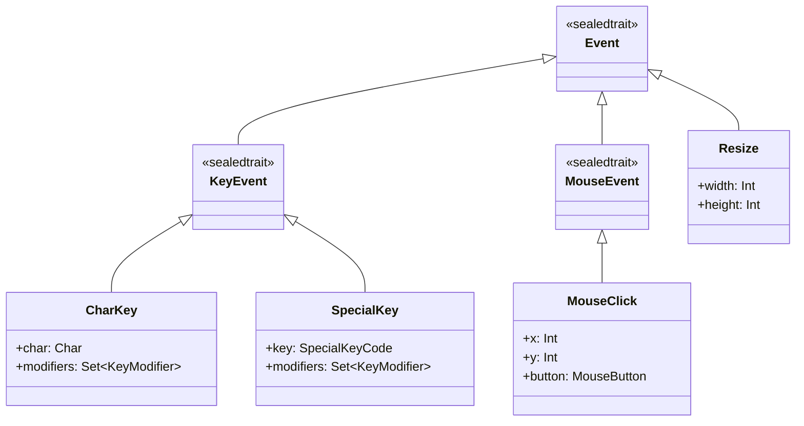
```mermaid
classDiagram
    class Event {
<<sealedtrait>>
}

class KeyEvent {
<<sealedtrait>>
}

class MouseEvent {
<<sealedtrait>>
}

class CharKey {
+char: Char
+modifiers: Set~KeyModifier~
}

class SpecialKey {
+key: SpecialKeyCode
+modifiers: Set~KeyModifier~
}

class MouseClick {
+x: Int
+y: Int
+button: MouseButton
}

class Resize {
+width: Int
+height: Int
 }

Event <|-- KeyEvent
Event <|-- MouseEvent
Event <|-- Resize
KeyEvent <|-- CharKey
KeyEvent <|-- SpecialKey
MouseEvent <|-- MouseClick
```

### Event Dispatcher Architecture

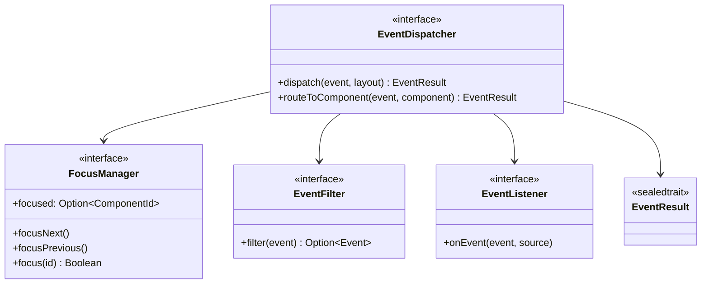
```mermaid
classDiagram
    class EventDispatcher {
        <<interface>>
        +dispatch(event, layout) EventResult
        +routeToComponent(event, component) EventResult
    }

    class FocusManager {
        <<interface>>
        +focused: Option~ComponentId~
        +focusNext()
        +focusPrevious()
        +focus(id) Boolean
    }

    class EventFilter {
        <<interface>>
        +filter(event) Option~Event~
    }

    class EventListener {
        <<interface>>
        +onEvent(event, source)
    }

    class EventResult {
<<sealedtrait>>
}

EventDispatcher --> FocusManager
EventDispatcher --> EventFilter
EventDispatcher --> EventListener
EventDispatcher --> EventResult
```

### Event Routing Flow

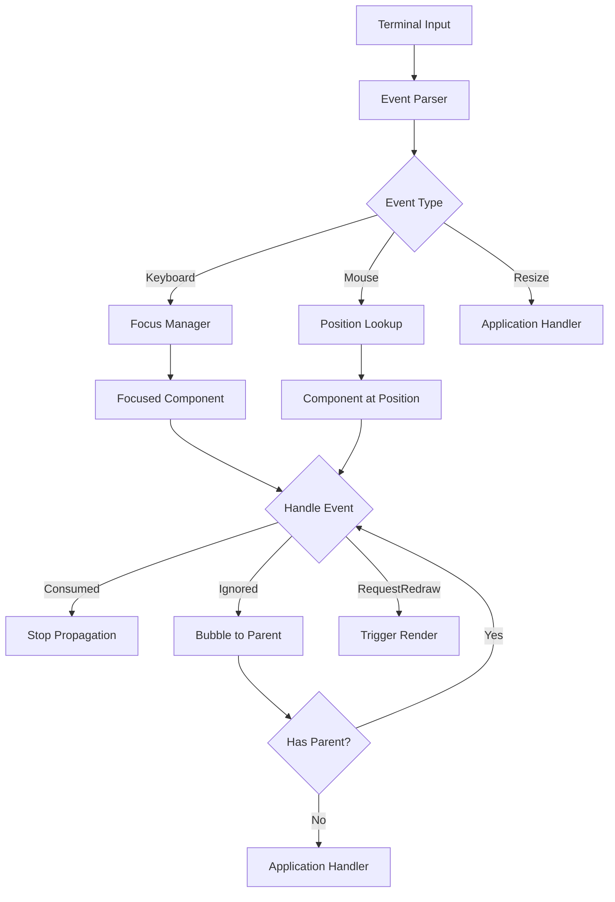
```mermaid
graph TD
    A[Terminal Input] --> B[Event Parser]
    B --> C{Event Type}
    C -->|Keyboard| D[Focus Manager]
    C -->|Mouse| E[Position Lookup]
    C -->|Resize| F[Application Handler]
    D --> G[Focused Component]
    E --> H[Component at Position]
    G --> I{Handle Event}
    H --> I
    I -->|Consumed| J[Stop Propagation]
    I -->|Ignored| K[Bubble to Parent]
    I -->|RequestRedraw| L[Trigger Render]
    K --> M{Has Parent?}
    M -->|Yes| I
    M -->|No| N[Application Handler]
```

### Responsibilities

- **Event**: Typed representation of terminal input
- **EventDispatcher**: Route events to appropriate components
- **FocusManager**: Track and manage keyboard focus
- **EventFilter**: Intercept and transform events globally
- **EventListener**: React to events for side effects
- **EventResult**: Component's response to event handling

### Key Interfaces

```scala
sealed trait Event

object Event:
  sealed trait KeyEvent extends Event

  case class CharKey(char: Char, modifiers: Set[KeyModifier]) extends KeyEvent

  case class SpecialKey(key: SpecialKeyCode, modifiers: Set[KeyModifier]) extends KeyEvent

  sealed trait MouseEvent extends Event

  case class MouseClick(x: Int, y: Int, button: MouseButton) extends MouseEvent

  case class Resize(width: Int, height: Int) extends Event

sealed trait EventResult

object EventResult:
  case object Consumed extends EventResult

  case object Ignored extends EventResult

  case object RequestRedraw extends EventResult

trait EventDispatcher:
  def dispatch(event: Event, layout: LayoutResult): EventResult

trait FocusManager:
  def focused: Option[ComponentId]

  def focusNext(): Unit

  def focus(id: ComponentId): Boolean
```

---

## Layer 6: Rendering Pipeline

**Purpose:** Coordinate the rendering process from component tree to terminal output.

### Rendering Pipeline Stages

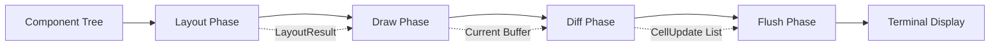
```mermaid
graph LR
    A[Component Tree] --> B[Layout Phase]
    B --> C[Draw Phase]
    C --> D[Diff Phase]
    D --> E[Flush Phase]
    E --> F[Terminal Display]
    B -.->|LayoutResult| C
    C -.->|Current Buffer| D
    D -.->|CellUpdate List| E
```

### Detailed Pipeline Flow

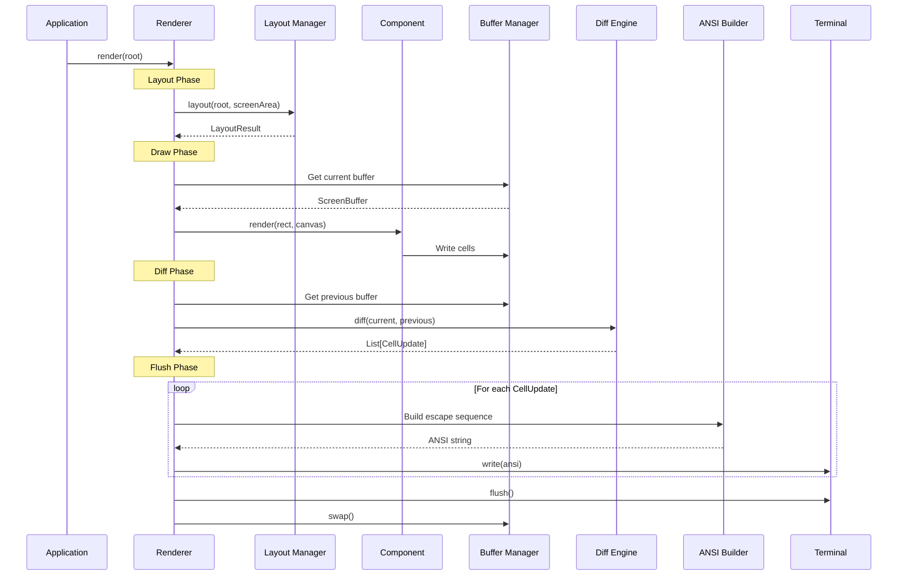
```mermaid
sequenceDiagram
    participant App as Application
    participant Render as Renderer
    participant Layout as Layout Manager
    participant Comp as Component
    participant Buf as Buffer Manager
    participant Diff as Diff Engine
    participant ANSI as ANSI Builder
    participant Term as Terminal
    App ->> Render: render(root)
    Note over Render: Layout Phase
    Render ->> Layout: layout(root, screenArea)
    Layout -->> Render: LayoutResult
    Note over Render: Draw Phase
    Render ->> Buf: Get current buffer
    Buf -->> Render: ScreenBuffer
    Render ->> Comp: render(rect, canvas)
    Comp ->> Buf: Write cells
    Note over Render: Diff Phase
    Render ->> Buf: Get previous buffer
    Render ->> Diff: diff(current, previous)
    Diff -->> Render: List[CellUpdate]
    Note over Render: Flush Phase
    loop For each CellUpdate
        Render ->> ANSI: Build escape sequence
        ANSI -->> Render: ANSI string
        Render ->> Term: write(ansi)
    end

    Render ->> Term: flush()
    Render ->> Buf: swap()
```

### Class Structure

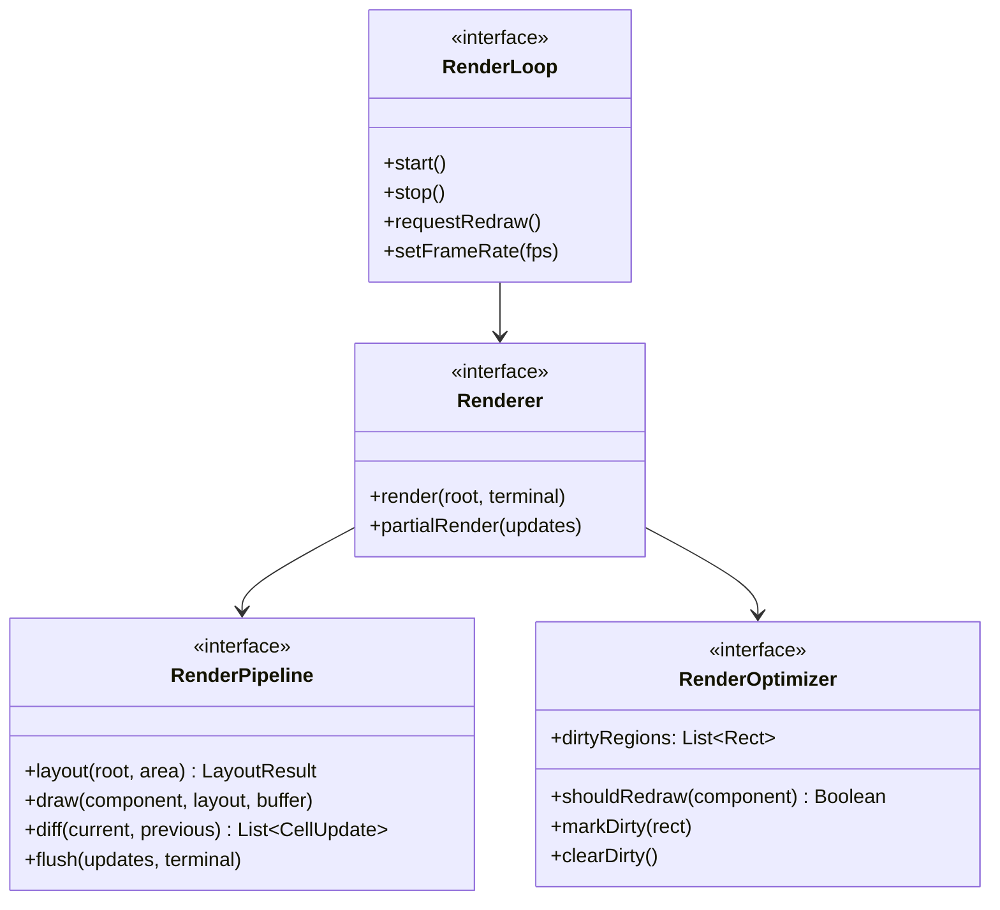
```mermaid
classDiagram
    class Renderer {
        <<interface>>
        +render(root, terminal)
        +partialRender(updates)
    }

    class RenderPipeline {
        <<interface>>
        +layout(root, area) LayoutResult
        +draw(component, layout, buffer)
        +diff(current, previous) List~CellUpdate~
        +flush(updates, terminal)
    }

    class RenderOptimizer {
        <<interface>>
        +shouldRedraw(component) Boolean
        +dirtyRegions: List~Rect~
        +markDirty(rect)
        +clearDirty()
    }

    class RenderLoop {
        <<interface>>
        +start()
        +stop()
        +requestRedraw()
        +setFrameRate(fps)
    }

    Renderer --> RenderPipeline
    Renderer --> RenderOptimizer
    RenderLoop --> Renderer
```

### Responsibilities

- **Renderer**: Orchestrate the complete rendering process
- **RenderPipeline**: Execute the four rendering phases
- **RenderOptimizer**: Track dirty regions to minimize work
- **RenderLoop**: Manage render timing and frame rate

### Rendering Modes

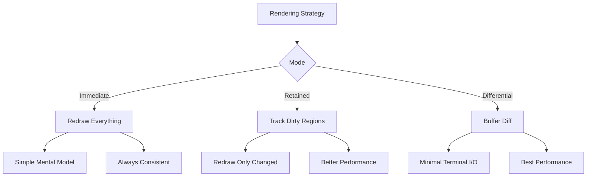
```mermaid
graph TD
    A[Rendering Strategy] --> B{Mode}
    B -->|Immediate| C[Redraw Everything]
    C --> D[Simple Mental Model]
    C --> E[Always Consistent]
    B -->|Retained| F[Track Dirty Regions]
    F --> G[Redraw Only Changed]
    F --> H[Better Performance]
    B -->|Differential| I[Buffer Diff]
    I --> J[Minimal Terminal I/O]
    I --> K[Best Performance]
```

### Key Interfaces

```scala
trait Renderer:
  def render(root: Component, terminal: Terminal): Unit

trait RenderPipeline:
  def layout(root: Component, area: Rect): LayoutResult

  def draw(component: Component, layout: LayoutResult, buffer: ScreenBuffer): Unit

  def diff(current: ScreenBuffer, previous: ScreenBuffer): List[CellUpdate]

  def flush(updates: List[CellUpdate], terminal: Terminal): Unit

trait RenderLoop:
  def start(): Unit

  def stop(): Unit

  def requestRedraw(): Unit

  def setFrameRate(fps: Int): Unit
```

---

## Layer 7: Application Framework

**Purpose:** Provide the main application lifecycle and state management.

### Application Architecture

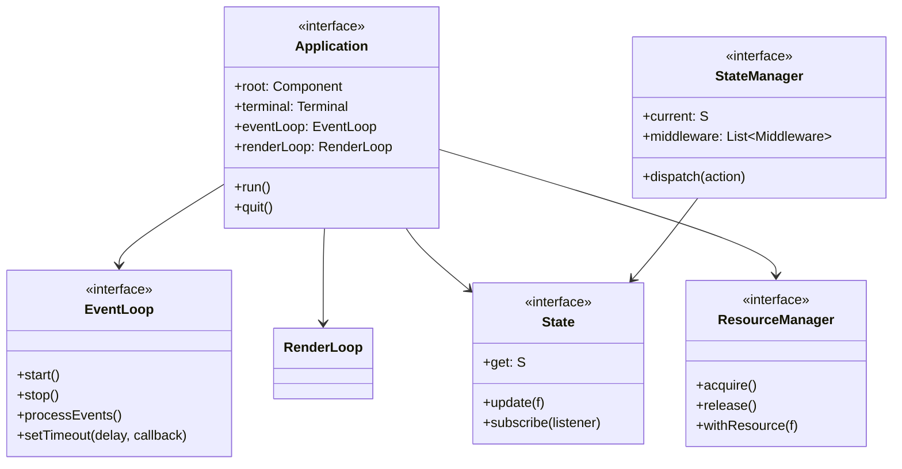
```mermaid
classDiagram
    class Application {
        <<interface>>
        +root: Component
        +terminal: Terminal
        +eventLoop: EventLoop
        +renderLoop: RenderLoop
        +run()
        +quit()
    }

    class EventLoop {
        <<interface>>
        +start()
        +stop()
        +processEvents()
        +setTimeout(delay, callback)
    }

    class State {
        <<interface>>
        +get: S
        +update(f)
        +subscribe(listener)
    }

    class StateManager {
        <<interface>>
        +current: S
        +dispatch(action)
        +middleware: List~Middleware~
    }

    class ResourceManager {
        <<interface>>
        +acquire()
        +release()
        +withResource(f)
    }

    Application --> EventLoop
    Application --> RenderLoop
    Application --> State
    Application --> ResourceManager
    StateManager --> State
```

### Application Lifecycle

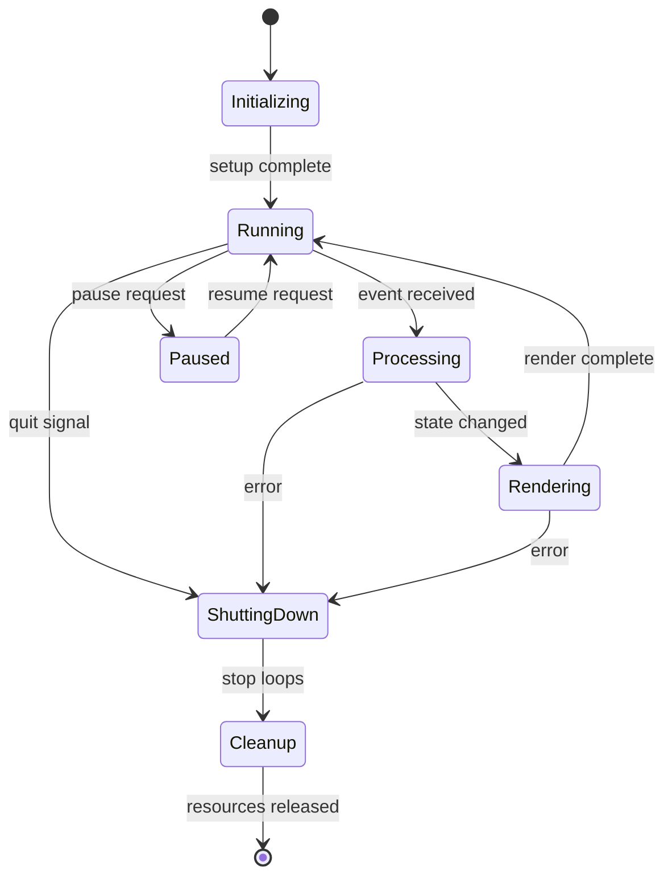
```mermaid
stateDiagram-v2
    [*] --> Initializing
    Initializing --> Running: setup complete
    Running --> Processing: event received
    Processing --> Rendering: state changed
    Rendering --> Running: render complete
    Running --> Paused: pause request
    Paused --> Running: resume request
    Running --> ShuttingDown: quit signal
    Processing --> ShuttingDown: error
    Rendering --> ShuttingDown: error
    ShuttingDown --> Cleanup: stop loops
    Cleanup --> [*]: resources released
```

### Main Application Loop

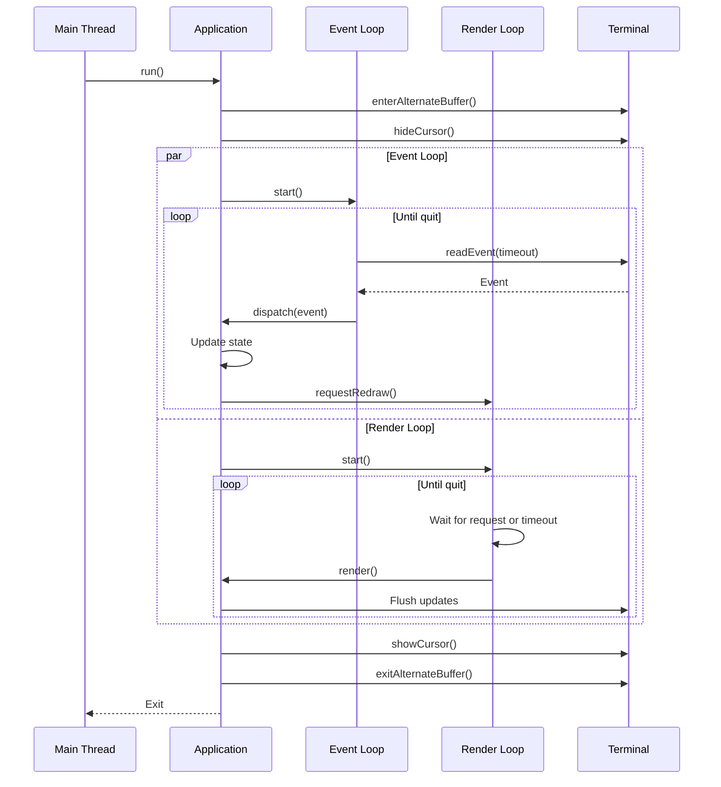
```mermaid
sequenceDiagram
    participant Main as Main Thread
    participant App as Application
    participant ELoop as Event Loop
    participant RLoop as Render Loop
    participant Term as Terminal
    Main ->> App: run()
    App ->> Term: enterAlternateBuffer()
    App ->> Term: hideCursor()

    par Event Loop
        App ->> ELoop: start()
        loop Until quit
            ELoop ->> Term: readEvent(timeout)
            Term -->> ELoop: Event
            ELoop ->> App: dispatch(event)
            App ->> App: Update state
            App ->> RLoop: requestRedraw()
        end
    and Render Loop
        App ->> RLoop: start()
        loop Until quit
            RLoop ->> RLoop: Wait for request or timeout
            RLoop ->> App: render()
            App ->> Term: Flush updates
        end
    end

    App ->> Term: showCursor()
    App ->> Term: exitAlternateBuffer()
    App -->> Main: Exit
```

### Responsibilities

- **Application**: Main entry point, lifecycle coordinator
- **EventLoop**: Process terminal input continuously
- **RenderLoop**: Manage rendering timing and frame rate
- **State**: Application state container with reactivity
- **StateManager**: Coordinate state updates and side effects
- **ResourceManager**: Ensure proper cleanup of terminal state

### Key Interfaces

```scala
trait Application:
  def root: Component

  def terminal: Terminal

  def eventLoop: EventLoop

  def renderLoop: RenderLoop

  def run(): Unit

  def quit(): Unit

trait EventLoop:
  def start(): Unit

  def stop(): Unit

  def processEvents(): Unit

trait State[S]:
  def get: S

  def update(f: S => S): Unit

  def subscribe(listener: S => Unit): Unit
```

---

## Communication Flows

### Downward Flow: Rendering

The rendering flow moves data from application state to screen pixels:

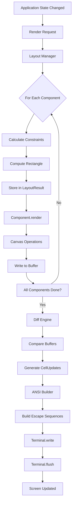
```mermaid
flowchart TD
    A[Application State Changed] --> B[Render Request]
    B --> C[Layout Manager]
    C --> D{For Each Component}
    D --> E[Calculate Constraints]
    E --> F[Compute Rectangle]
    F --> G[Store in LayoutResult]
    G --> H[Component.render]
    H --> I[Canvas Operations]
    I --> J[Write to Buffer]
    J --> K[All Components Done?]
    K -->|No| D
    K -->|Yes| L[Diff Engine]
    L --> M[Compare Buffers]
    M --> N[Generate CellUpdates]
    N --> O[ANSI Builder]
    O --> P[Build Escape Sequences]
    P --> Q[Terminal.write]
    Q --> R[Terminal.flush]
    R --> S[Screen Updated]
```

### Upward Flow: Event Handling

Events travel from terminal input to application state:

```mermaid
flowchart TD
    A[Terminal Input] --> B[Terminal.readEvent]
    B --> C[Parse into Event Object]
    C --> D{Event Type?}
    D -->|Keyboard| E[Focus Manager]
    E --> F[Get Focused Component]
    D -->|Mouse| G[Layout Lookup]
    G --> H[Find Component at Position]
    D -->|Resize| I[Application Handler]
    F --> J[Component.handleEvent]
    H --> J
    J --> K{EventResult?}
    K -->|Consumed| L[Stop Propagation]
    K -->|Ignored| M{Has Parent?}
    K -->|RequestRedraw| N[Render Loop]
    M -->|Yes| O[Parent.handleEvent]
    M -->|No| P[Application Handler]
    O --> K
    L --> Q[Event Processing Complete]
    P --> Q
    N --> R[Mark Dirty]
    R --> S[Schedule Render]
    S --> Q
```

### Bi-Directional: Component ↔ Layout

Components and the layout manager communicate bidirectionally:

```mermaid
sequenceDiagram
    participant LM as Layout Manager
    participant Cont as Container
    participant Child as Child Component
    Note over LM, Child: Layout Negotiation
    LM ->> Cont: Get your constraints
    Cont -->> LM: My strategy + children
    LM ->> Child: What are your constraints?
    Child -->> LM: ComponentConstraints
    Note over LM: Calculate layout
    LM ->> Cont: Here's your rect
    Cont -->> LM: Acknowledged
    LM ->> Child: Here's your rect
    Child -->> LM: Acknowledged
    Note over LM, Child: Rendering Phase
    Cont ->> Child: Render in this rect
    Child ->> Child: Draw content
    Child -->> Cont: Done
```

### Component Isolation

Components cannot directly communicate—they use events and state:

```mermaid
graph TD
    A[Component A] -.->|Cannot directly access| B[Component B]
    A -->|Fire Event| C[Event System]
    C -->|Route to| B
    A -->|Update| D[Shared State]
    D -->|Subscribe| B
    style A fill: #e1f5ff
    style B fill: #e1ffe1
    style C fill: #fff5e1
    style D fill: #ffe1e1
```

---

## Design Principles

### 1. Layered Architecture with Clear Boundaries

Each layer has a single responsibility and communicates only with adjacent layers:

- **Terminal Layer**: ANSI operations, no business logic
- **Buffer Layer**: Screen state, no rendering decisions
- **Canvas Layer**: Drawing primitives, no layout knowledge
- **Layout Layer**: Positioning math, no rendering details
- **Component Layer**: UI logic, delegates to lower layers
- **Rendering Layer**: Orchestration, no component logic
- **Application Layer**: Lifecycle, no rendering details

**Benefit**: Changes in one layer don't cascade through the system.

### 2. Immediate Mode Rendering

Components don't store rendered state—they redraw on every frame:

```scala
// Component doesn't track what was drawn
def render(area: Rect, canvas: Canvas): Unit = {
  // Always draw from scratch
  canvas.putText(0, 0, currentText, currentStyle)
  canvas.drawBox(area, boxStyle, title)
}
```

**Advantages**:

- Simple mental model
- No state synchronization bugs
- Easy animations

**Optimization**: Buffer diffing ensures only changed cells hit the terminal.

### 3. Constraint-Based Layouts

Express intent, not pixels:

```scala
// Declarative sizing
Flex(Horizontal, List(
  Constraint.Percentage(30), // Sidebar scales
  Constraint.Fill, // Content takes rest
  Constraint.Fixed(20) // Tool panel fixed
))
```

**Benefit**: Layouts adapt to terminal size automatically.

### 4. Modern Terminals Only - Fail Fast

The library validates terminal capabilities at startup and fails immediately if requirements are not met:

```mermaid
graph TD
    A[Startup] --> B{Check Capabilities}
    B -->|TTY + Colors + Unicode| C[Proceed]
    B -->|Missing Requirements| D[Fail with Clear Error]
    C --> E[Full Feature Set]
    D --> F[List Missing Requirements]
    F --> G[Suggest Supported Terminals]
```

**Requirements (all must be met)**:

- Interactive TTY (not pipe, not redirected)
- 256+ color support
- Unicode support (UTF-8 locale)
- Modern terminal emulator

**No fallback paths.** If requirements are not met, the library fails with a clear error message listing what's missing
and which terminals are supported.

### 5. Component Isolation

Components can only:

- Draw within their allocated `Rect`
- Access a `Canvas` clipped to their boundaries
- Communicate via events and shared state

They cannot:

- Draw outside their rect
- Directly access sibling components
- Modify terminal state directly

**Benefit**: Components are testable in isolation.

### 6. Event Bubbling with Consumption

Events propagate through the component tree:

```
1. Target component (e.g., focused button)
   ↓ if Ignored
2. Parent container
   ↓ if Ignored
3. Root component
   ↓ if Ignored
4. Application handlers
```

`EventResult.Consumed` stops propagation.

**Benefit**: Natural event handling hierarchy, like DOM events.

### 7. Double Buffering for Efficiency

Always maintain two buffers:

```mermaid
graph LR
    A[Current Buffer] -->|Draw| B[Components Write Here]
    C[Previous Buffer] -->|Compare| D[Diff Engine]
    B -->|After Render| E[Swap]
    E -->|Current becomes Previous| A
```

**Benefit**: Only changed cells are written to terminal.

### 8. Resource Safety

Terminal state must be restored on all exits:

```scala
def withResource[A](f: => A): A = {
  try {
    terminal.enterAlternateBuffer()
    terminal.hideCursor()
    f
  } finally {
    terminal.showCursor()
    terminal.exitAlternateBuffer()
  }
}
```

**Benefit**: Terminal is never left in a broken state.

---

## Implementation Considerations

### Performance Targets

Based on the research document:

- **Text wrapping**: <500ms for 10KB documents
- **Pattern recognition**: <100ms per 1KB
- **Capability detection**: <200ms
- **Frame rate**: 30-60 FPS for interactive UIs
- **Event latency**: <16ms (60 FPS target)

### Memory Management

- **Cell size**: ~32 bytes (char + style + metadata)
- **Full screen buffer**: 80×24 = 1,920 cells ≈ 60KB
- **Double buffering**: 2× = 120KB
- Keep previous states for diffing
- Clear buffers after swap to reclaim memory

### Threading Model

Recommended architecture:

```mermaid
graph TD
    A[Main Thread] --> B[Event Loop Thread]
    A --> C[Render Loop Thread]
    B -->|Events| D[Thread-Safe Queue]
    D --> A
    C -->|Render Requests| E[Thread-Safe Flag]
    A -->|State Changes| E
```

**Key Points**:

- Event loop on dedicated thread (blocking reads)
- Render loop on dedicated thread (timed frames)
- Main thread processes events and updates state
- Thread-safe communication via queues/flags

### Error Handling Strategy

Use typed errors for different failure modes:

```scala
sealed trait TerminalError

case class IOError(cause: IOException) extends TerminalError

case class CapabilityError(missing: String) extends TerminalError

case class LayoutError(message: String) extends TerminalError
```

Always restore terminal state:

```scala
try {
  runApplication()
} catch {
  case e: Exception =>
    // Ensure cleanup
    terminal.showCursor()
    terminal.exitAlternateBuffer()
    throw e
}
```

### Testing Strategy

**Unit Tests**:

- Individual layer components in isolation
- Mock dependencies (e.g., mock Terminal for testing Buffer)

**Integration Tests**:

- Full rendering pipeline with mock terminal
- Event routing through component tree
- Layout calculation correctness

**Property-Based Tests**:

- Layout constraints always sum to available space
- Buffer diff is minimal (no redundant updates)
- Event routing reaches correct components

**Supported Terminal Tests**:

- macOS: Terminal.app, iTerm2
- Linux: GNOME Terminal, Konsole, Alacritty, Kitty
- Windows: Windows Terminal only
- SSH sessions with modern terminal clients

**Note:** Legacy terminals (cmd.exe, dumb terminals, Linux console) are not tested as they are out of scope.

### ZIO Integration

This architecture maps naturally to ZIO:

```scala
// Layer 1: Terminal as ZIO service
trait Terminal:
  def write(text: String): Task[Unit]

  def readEvent(timeout: Duration): Task[Option[Event]]

  def size: UIO[(Int, Int)]

// Resource management
val terminalLayer: ZLayer[Any, IOException, Terminal] =
  ZLayer.scoped {
    ZIO.acquireRelease(
      acquire = Terminal.initialize
    )(
      release = terminal => terminal.cleanup
    )
  }

// Application
def runApp: ZIO[Terminal & EventLoop & RenderLoop, IOException, Unit] =
  for {
    _ <- ZIO.serviceWithZIO[Terminal](_.enterAlternateBuffer())
    _ <- ZIO.serviceWithZIO[EventLoop](_.start())
    _ <- ZIO.serviceWithZIO[RenderLoop](_.start())
    result <- applicationLogic
  } yield result
```

**Benefits**:

- Automatic resource cleanup
- Composable effects
- Type-safe dependency injection
- Built-in error handling

---

## Conclusion

This architecture provides a complete foundation for terminal manipulation with:

✅ **7 distinct layers** with clear responsibilities
✅ **Bi-directional communication** (render down, events up)
✅ **Component isolation** for testability
✅ **Efficient rendering** via double-buffering and diffing
✅ **Flexible layouts** using constraint-based system
✅ **Modern terminals only** - no legacy fallback complexity
✅ **Event-driven interaction** with focus management
✅ **Resource safety** with proper cleanup

The system is designed to be:

- **Modular**: Each layer can be developed and tested independently
- **Extensible**: New components and layout strategies are easy to add
- **Efficient**: Differential rendering minimizes terminal I/O
- **Simple**: No fallback paths means less code and fewer bugs
- **Type-safe**: Strong typing catches errors at compile time

**Scope Reminder:** This architecture targets modern interactive terminals only. Legacy terminals (cmd.exe, dumb
terminals) and non-interactive environments (CI/CD, pipes) are explicitly not supported.

Next steps:

1. Begin with Layer 1 (Terminal abstraction)
2. Implement Layer 2 (Buffer management)
3. Build upward through the layers
4. Implement concrete components for common use cases
5. Create comprehensive test suite
6. Optimize based on performance profiling

---

**Document Version:** 1.0
**Last Updated:** 2025-10-27
